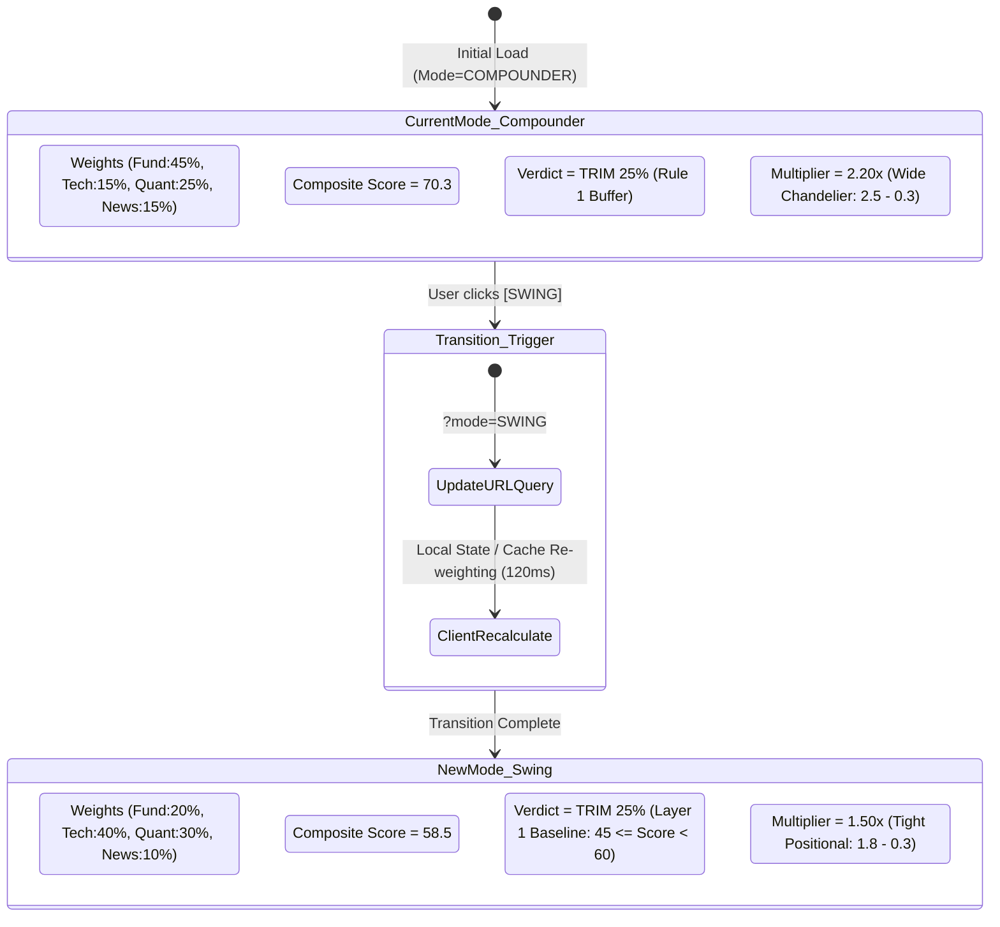
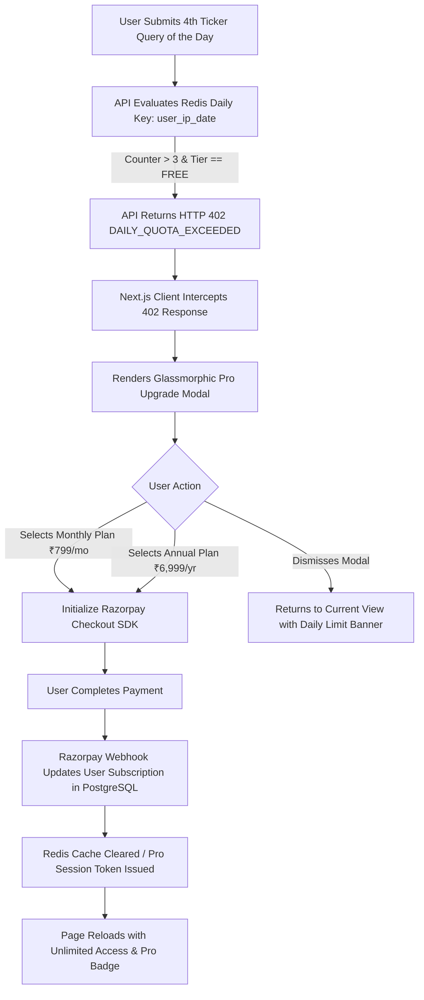
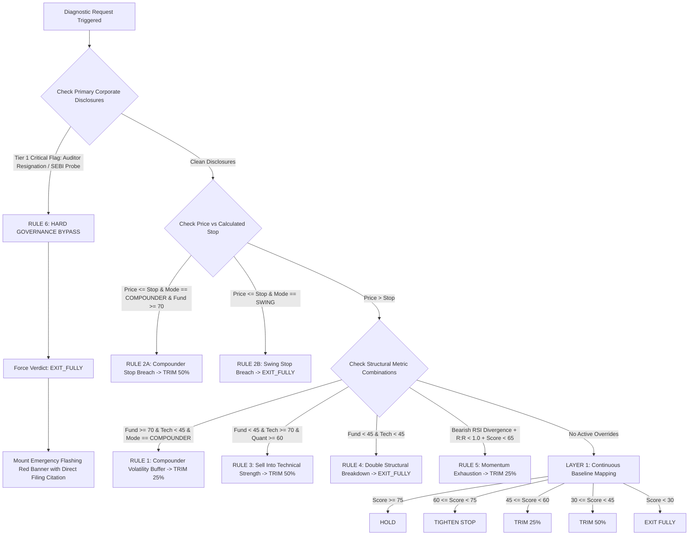

# Application Flow & User Journey Architecture — v1.1
# Project: "When to Sell" Engine (Kairos Quant)
**Document Status:** Approved Implementation Flow  
**Parent Documents:** [PRD.md](file:///d:/Kairos/PRD.md) • [TRD.md](file:///d:/Kairos/TRD.md) • [UI_UX.md](file:///d:/Kairos/UI_UX.md)  
**Design Philosophy:** "Bloomberg Terminal Meets Linear" — Monospace, Deterministic, State-Driven

---

## 1. Master Navigation & System Architecture Flow

The Kairos terminal architecture consists of 4 primary views and 2 global modal states:

```mermaid
flowchart TD
    A[Entry: Homepage / Landing Hero] -->|Cmd+K or Monospace Search| B(Staged Terminal Analysis State)
    A -->|Direct URL: /diagnostic/SYMBOL?mode=MODE| B
    
    B -->|Check Quota Middleware: Passes| C[Quant Terminal Dashboard]
    B -->|Check Quota Middleware: 4th Scan Exceeded| D[Pro Upgrade Modal]
    
    C -->|Toggle Horizon: SWING / COMPOUNDER| C1[Instant Client Re-Score & Chart Ratchet Transition]
    C -->|Inspect Pillar: [FUND] / [TECH] / [QUANT] / [NEWS]| C2[Inline Ledger Deep-Dive Drawer]
    C -->|Scrub Trim Simulator Slider| C3[Real-Time Tax & Breakeven Cushion Recalculation]
    C -->|Inspect Audit Footnote| C4[Cryptographic SHA-256 Audit Drawer]
    
    D -->|Razorpay 1-Click Pro Checkout| E[Pro Tier Activated - Unlimited Scans]
    E --> C
    
    C -->|New Ticker Search| B
```

---

## 2. End-to-End User Journeys

### 2.1 Journey 1: Discovery, Homepage & Ticker Search
1. **User Arrives at `/`:**
   - Sees the minimal engineered header (`KAIROS`, right-aligned mode selector `SWING • [COMPOUNDER ●]`, live scan counter `⚡ 2/3 SCANS`).
   - The hero section renders a dark obsidian background (`#07090E`) with an ultra-faint Aceternity grid ($4\%$ line opacity).
   - High-contrast headline: `"KAIROS. KNOW WHEN TO SELL — BEFORE THE MARKET TELLS YOU."`
   - Scans the 3 below-the-fold quant proof modules:
     - **Proof 01:** Macro Backtest Attribution (Drawdown reduction vs Buy & Hold).
     - **Proof 02:** Dual-Horizon Conflict Matrix in action.
     - **Proof 03:** SHA-256 Deterministic Reproducibility proof.
2. **Search Input Interaction:**
   - User clicks into the monospace terminal search input (`> Search NSE/BSE ticker... ▋`).
   - Typing triggers a $150\text{ms}$ debounced query to `/api/v1/stocks/search?q=...`.
   - Dropdown displays matching tickers with company name, sector, and market-cap bucket badge (`LARGE_CAP`, `MID_CAP`, `SMALL_CAP`).
   - Recent searches from `localStorage` appear on focus if query is empty.
3. **Execution Trigger:**
   - User presses `Enter` or clicks a search result (e.g. `TATAMOTORS.NS`).
   - Client routes to `/diagnostic/TATAMOTORS.NS?mode=COMPOUNDER`.

---

### 2.2 Journey 2: Staged Terminal Analysis State (Loading Sequence)

When the diagnostic route initializes, the UI renders a **staged, monospace execution terminal sequence** ($1.2\text{s}$ total choreographed window):

> **Note on Staged Terminal Pacing:** The $1.2\text{s}$ staged terminal sequence is a deliberate, choreographed **UI/UX perceptual pacing mechanism** to build cognitive trust and visual comprehension of multi-module quant screening. The underlying FastAPI backend computes cold queries with $P95 < 350\text{ms}$ and cached queries in $< 20\text{ms}$. The frontend buffers and streams each stage smoothly over the $\approx 1.2\text{s}$ window.

```mermaid
sequenceDiagram
    autonumber
    actor User
    participant Web as Next.js Client
    participant API as FastAPI Backend
    participant Redis as Redis Cache / Rate Limiter
    participant Engine as Quant Math Engine
    participant FinBERT as FinBERT ONNX Worker

    User->>Web: Submits Ticker (e.g. TATAMOTORS.NS, mode=COMPOUNDER)
    Web->>Web: Mounts Terminal Loading Stream (Monospace)
    
    Web->>API: GET /api/v1/diagnostic/TATAMOTORS.NS?horizon_mode=COMPOUNDER
    API->>Redis: Quota Check (Burst Token Bucket + Daily INCR Key)
    alt Daily Quota Exceeded (> 3 scans for free user)
        Redis-->>API: Quota Exhausted
        API-->>Web: HTTP 402 { "error": "DAILY_QUOTA_EXCEEDED", "reset_at": "..." }
        Web->>Web: Intercepts & Mounts Pro Upgrade Modal
    else Quota Approved
        Redis-->>API: Quota OK (X-Daily-Quota-Remaining: 2)
        
        par Parallel Execution
            API->>Engine: Fetch OHLCV + Calculate Wilder ATR(14) & Chandelier Stop
            API->>Engine: Compute Fundamental Screener (PEG, ROCE, Pledge)
            API->>FinBERT: Inference on BSE/NSE Filings
        end
        
        Engine-->>API: Sub-scores (s_fund=84, s_tech=38, s_quant=65, s_news=70)
        API->>Engine: ConflictResolutionEngine.resolve_verdict()
        Engine-->>API: Verdict: TRIM_25, ActiveRule: RULE_1, Composite: 70.3
        
        API-->>Web: 200 OK (Full Diagnostic JSON + SHA-256 Hash)
        
        Note over Web: Stages Complete with Emerald Checkmarks (✓ 0.4s, ✓ 0.6s, ✓ 0.3s)
        Web->>Web: Terminal Stream Collapses; Dashboard Resolves
    end
```

---

### 2.3 Journey 3: The Quant Terminal Dashboard Experience

Upon payload resolution, the dashboard mounts with strict typographic hierarchy:

```
+-------------------------------------------------------------------------------------------------------------------+
| 1. THE TYPOGRAPHIC VERDICT (Dominant Header)                                                                      |
|    • "TRIM 25%" rendered in 56px Bold Warm Amber (#F59E0B) with subtle glow.                                     |
|    • Monospace Score Counter: Animates 0 -> 70.3 over 400ms.                                                      |
|    • Context Headline: "Fundamental growth strong, but technical momentum waning. Lock partial profit..."         |
|    • Monospace Rule Tag: [RULE_1_COMPOUNDER_VOLATILITY_BUFFER] • Weights: Fund 45% Tech 15% Quant 25% News 15%    |
+-------------------------------------------------------------------------------------------------------------------+
                                       │
                                       ▼
+-------------------------------------------------------------------------------------------------------------------+
| 2. CHANDELIER TRAILING STOP & VOLATILITY FLOOR (TradingView Canvas)                                               |
|    • Interactive chart directly below the verdict.                                                                |
|    • Visualizes Candlesticks, 50 DMA, 200 DMA, Target Line (₹1,080), and Ascending Chandelier Stop Line (₹885.00).|
|    • Telemetry Bar: Current Stop ₹885.00 (-6.10% cushion) • Target ₹1,080.00 (+14.59%) • R:R 2.39:1               |
|    • Timeframe Switcher: [15m] [1D] [1W].                                                                         |
+-------------------------------------------------------------------------------------------------------------------+
                                       │
                                       ▼
+-------------------------------------------------------------------------------------------------------------------+
| 3. 4-MODULE DIAGNOSTIC LEDGER (Stacked Monospace Table — No Icon Badges)                                          |
|    • [FUND]  84.0 | STRONG | PEG: 1.12 (<1.5) • ROCE: +3.2% QoQ • Pledge: 0.0%           | [▾ Expand Deep-Dive]   |
|    • [TECH]  38.0 | WEAK   | Price < 50 DMA • RSI(14): 41.2 • Delivery Vol: 34.2% (Low)  | [▾ Expand Deep-Dive]   |
|    • [QUANT] 65.0 | FAIR   | ATR: ₹26.14 • Cushion: 6.10% • Kelly Trim: 25.0%            | [▾ Expand Deep-Dive]   |
|    • [NEWS]  70.0 | POS    | FinBERT: +0.84 • Q1 PAT: +24% YoY • 0 Regulatory Flags      | [▾ Expand Deep-Dive]   |
|                                                                                                                   |
|    * Clicking [▾ Expand Deep-Dive] opens inline sub-table with 5Y PE Median, FCF conversion, D/E ratios.         |
+-------------------------------------------------------------------------------------------------------------------+
                                       │
                                       ▼
+-------------------------------------------------------------------------------------------------------------------+
| 4. "WHAT IF I TRIM NOW?" CAPITAL HARVESTING SIMULATOR                                                             |
|    • User enters Buy Price (e.g. ₹780.00) & Quantity (e.g. 100 Shares).                                          |
|    • Adjusts Trim Slider to 25% (or clicks [25% Trim] preset).                                                    |
|    • Instant Tabular Calculation:                                                                                 |
|      - Gross Realized: ₹23,562.50  •  Realized Gain: ₹4,062.50  •  STCG (20%): ₹812.50  •  Net Cash: ₹22,750.00  |
|      - Original Breakeven: ₹780.00 -> New Breakeven on 75 shares: ₹725.83 (+6.94% Downside Cushion Expansion)    |
+-------------------------------------------------------------------------------------------------------------------+
                                       │
                                       ▼
+-------------------------------------------------------------------------------------------------------------------+
| 5. REGULATORY DEFENSIVE AUDIT FOOTER                                                                              |
|    • SEBI non-advisory sandbox compliance text in high-contrast slate (--text-disclaimer, 7.5:1).                 |
|    • SHA-256 Audit Hash: [ a4f89d38c642bf1c94afbf4c8996fb92427ae41e4649b934ca495991b7852c91 ]                   |
+-------------------------------------------------------------------------------------------------------------------+
```

---

### 2.4 Journey 4: Horizon Mode Real-Time Switching Flow

When a user on the dashboard clicks the navbar mode toggle from `[COMPOUNDER ●]` to `[SWING ●]`:



#### Re-evaluation Logic on the Same Underlying Stock (`TATAMOTORS.NS`):
- **Raw Module Scores:** $s_{\text{fund}} = 84.0$, $s_{\text{tech}} = 38.0$, $s_{\text{quant}} = 65.0$, $s_{\text{news}} = 70.0$.
- **Swing Mode Weights Applied (Large-Cap):** $w_{\text{fund}} = 0.20$, $w_{\text{tech}} = 0.40$, $w_{\text{quant}} = 0.30$, $w_{\text{news}} = 0.10$.
- **Swing Composite Math:**
  $$S_{\text{composite}} = 0.20(84.0) + 0.40(38.0) + 0.30(65.0) + 0.10(70.0) = 16.80 + 15.20 + 19.50 + 7.00 = \mathbf{58.5}$$
- **State Machine Evaluation:** Rule 1 is gated to `COMPOUNDER` mode and does not fire; price ($₹942.50$) is above calculated stop floor ($₹885.00$). Evaluates via Layer 1 Continuous Baseline ($45 \le S_{\text{composite}} < 60$) to **`TRIM 25%`** (due to heavy $40\%$ technical weighting reflecting momentum breakdown).
- **ATR Multiplier Recalibration:** $k_{\text{base}} = 1.80$ (Swing), $\Delta_k = -0.30$ (Large-Cap discount) $\rightarrow \mathbf{1.50\times}$.

---

### 2.5 Journey 5: Free-Tier Daily Quota Gating & Pro Monetization



---

### 2.6 Journey 6: Anomaly Guards, Overrides & Error Handling Flow



---

## 3. Screen States & Edge Case Matrix

| Screen State / Edge Case | Trigger Condition | Visual & Functional Behavior | User Action Available |
|---|---|---|---|
| **Terminal Loading** | Ticker submission until 200 OK payload | Staged 5-line monospace execution sequence with emerald checkmarks and pulsing ellipsis. | None (Auto-resolves within choreographed $1.2\text{s}$). |
| **Active Tier 1 Alert** | Auditor Resignation or SEBI Fraud Probe detected in corporate filings | Full-width flashing crimson banner (`#DC2626`), immediate `EXIT FULLY` verdict, diagnostic scores grayed out with disclosure citation. | Click citation link to read primary exchange filing. |
| **Invalid Target / Inverted Stop** | User inputs target price $\le$ stop-loss price | Target field flashes amber; Kelly formula defaults to $0.0\%$ trim override with inline helper: *"Target must exceed calculated stop floor."* | Adjust custom target price or toggle back to Analyst Consensus. |
| **Delisted / Invalid Symbol** | User searches unknown or defunct ticker | Terminal displays: `> ERROR: SYMBOL NOT FOUND ON NSE/BSE REGISTRY` with suggested active tickers. | Click suggested ticker or retry search. |
| **Upstream Data Lag** | Yahoo Finance / Exchange API delay $> 5\text{s}$ | Graceful fallback to cached TimescaleDB OHLCV data with a subtle warning pill: `⚠ Cached Data (15m delay)`. | Click `[Force Refresh]` button. |
| **Daily Quota Exceeded** | Free user attempts 4th scan in 24 hours | Intercepted via `HTTP 402` with Pro Upgrade Modal explaining value proposition (unlimited scans, WhatsApp breach alerts). | Upgrade via Razorpay or wait until midnight IST reset. |

---

## 4. Mobile & Touch Responsive Adaptation Flow

1. **Touch Navigation:**
   - Tap on the header search icon mounts a full-screen mobile search modal with auto-focused keypad.
   - Mode switcher becomes an ultra-compact top toggle.
2. **Dynamic Sticky Verdict Bar:**
   - When the user scrolls past the top verdict headline down into the chart or simulator, a fixed **$48\text{px}$ bottom execution bar** slides into view:
     `TATAMOTORS • ₹942.50 • VERDICT: TRIM 25% (Stop: ₹885.00)`
3. **Interactive Charting on Touch:**
   - Single-finger drag pans historical candles.
   - Pinch gesture scales timeframe.
   - Long-press activates the crosshair inspect drawer showing exact cushion % to Chandelier stop floor at that bar.
4. **Stacked Ledger Accordions:**
   - Monospace pillar rows collapse into high-density swipeable accordion rows with clear status tags (`STRONG`, `WEAK`, `FAIR`, `POS`).

---
*Ready for engineering implementation.*
