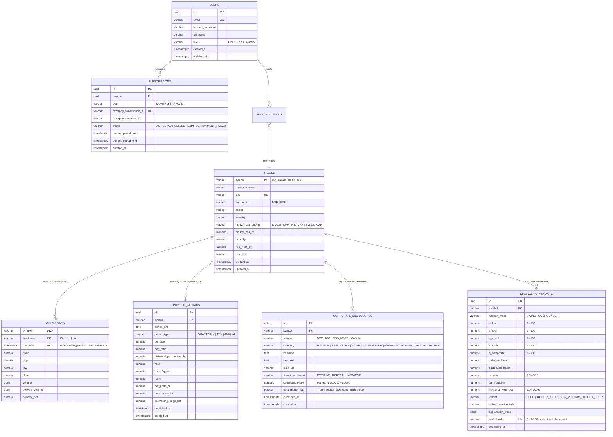

# Backend Database Schema & Data Contracts — v1.1
# Project: "When to Sell" Engine (Kairos Quant)
**Document Status:** Approved Architecture & Database Specification  
**Parent Documents:** [PRD.md](file:///d:/Kairos/PRD.md) • [TRD.md](file:///d:/Kairos/TRD.md) • [UI_UX.md](file:///d:/Kairos/UI_UX.md) • [APP_FLOW.md](file:///d:/Kairos/APP_FLOW.md)  
**Database Stack:** PostgreSQL 16 + TimescaleDB Extension • Redis 7 • SQLAlchemy 2.0 (Async) • Pydantic v2

---

## 1. Relational & Time-Series Architecture Overview

The Kairos backend data layer is engineered for institutional low latency ($P95 < 80\text{ms}$ cached, $< 350\text{ms}$ cold compute) and deterministic auditability:



---

## 2. Complete PostgreSQL & TimescaleDB DDL Specification

```sql
-- ============================================================================
-- KAIROS QUANT DIAGNOSTIC TERMINAL — DATABASE SCHEMA DDL
-- Target: PostgreSQL 16 with TimescaleDB 2.14+
-- ============================================================================

-- 0. Extensions & Core Utilities
CREATE EXTENSION IF NOT EXISTS "uuid-ossp";
CREATE EXTENSION IF NOT EXISTS "pgcrypto";
CREATE EXTENSION IF NOT EXISTS "timescaledb" CASCADE;

-- 1. Master Stocks Universe
CREATE TABLE stocks (
    symbol VARCHAR(30) PRIMARY KEY,
    company_name VARCHAR(255) NOT NULL,
    isin VARCHAR(20) UNIQUE NOT NULL,
    exchange VARCHAR(10) NOT NULL CHECK (exchange IN ('NSE', 'BSE')),
    sector VARCHAR(100) NOT NULL,
    industry VARCHAR(100),
    market_cap_bucket VARCHAR(20) NOT NULL CHECK (market_cap_bucket IN ('LARGE_CAP', 'MID_CAP', 'SMALL_CAP')),
    market_cap_cr NUMERIC(15, 2) NOT NULL DEFAULT 0.00,
    beta_1y NUMERIC(5, 2) NOT NULL DEFAULT 1.00,
    free_float_pct NUMERIC(5, 2) DEFAULT 0.00,
    is_active BOOLEAN NOT NULL DEFAULT TRUE,
    created_at TIMESTAMPTZ NOT NULL DEFAULT NOW(),
    updated_at TIMESTAMPTZ NOT NULL DEFAULT NOW()
);

CREATE INDEX idx_stocks_search ON stocks (symbol, company_name) WHERE is_active = TRUE;
CREATE INDEX idx_stocks_bucket ON stocks (market_cap_bucket, is_active);

-- 2. TimescaleDB Partitioned OHLCV Bars
CREATE TABLE ohlcv_bars (
    symbol VARCHAR(30) NOT NULL REFERENCES stocks(symbol) ON DELETE CASCADE,
    timeframe VARCHAR(10) NOT NULL CHECK (timeframe IN ('15m', '1d', '1w')),
    bar_time TIMESTAMPTZ NOT NULL,
    open NUMERIC(12, 2) NOT NULL CHECK (open > 0),
    high NUMERIC(12, 2) NOT NULL CHECK (high > 0),
    low NUMERIC(12, 2) NOT NULL CHECK (low > 0),
    close NUMERIC(12, 2) NOT NULL CHECK (close > 0),
    volume BIGINT NOT NULL CHECK (volume >= 0),
    delivery_volume BIGINT NOT NULL DEFAULT 0,
    delivery_pct NUMERIC(5, 2) NOT NULL DEFAULT 0.00,
    PRIMARY KEY (symbol, timeframe, bar_time),
    CONSTRAINT chk_high_low CHECK (high >= low AND high >= open AND high >= close AND low <= open AND low <= close)
);

-- Convert to Hypertable with 1-month chunk interval
SELECT create_hypertable('ohlcv_bars', 'bar_time', chunk_time_interval => INTERVAL '1 month', if_not_exists => TRUE);

-- Timescale Compression Policy (Compress chunks older than 3 months)
ALTER TABLE ohlcv_bars SET (
    timescaledb.compress,
    timescaledb.compress_segmentby = 'symbol, timeframe',
    timescaledb.compress_orderby = 'bar_time DESC'
);
SELECT add_compression_policy('ohlcv_bars', INTERVAL '3 months', if_not_exists => TRUE);

-- High-Frequency Retrieval Index
CREATE INDEX idx_ohlcv_lookup ON ohlcv_bars (symbol, timeframe, bar_time DESC);

-- 3. Fundamental Financial Ratios & Balance Sheet Health
CREATE TABLE financial_metrics (
    id UUID PRIMARY KEY DEFAULT gen_random_uuid(),
    symbol VARCHAR(30) NOT NULL REFERENCES stocks(symbol) ON DELETE CASCADE,
    period_end DATE NOT NULL,
    period_type VARCHAR(15) NOT NULL CHECK (period_type IN ('QUARTERLY', 'TTM', 'ANNUAL')),
    pe_ratio NUMERIC(10, 2),
    peg_ratio NUMERIC(10, 2),
    historical_pe_median_5y NUMERIC(10, 2),
    roce NUMERIC(8, 2),
    roce_3q_ma NUMERIC(8, 2),
    fcf_cr NUMERIC(18, 2),
    net_profit_cr NUMERIC(18, 2),
    debt_to_equity NUMERIC(8, 2),
    promoter_pledge_pct NUMERIC(6, 2) NOT NULL DEFAULT 0.00,
    published_at TIMESTAMPTZ NOT NULL,
    created_at TIMESTAMPTZ NOT NULL DEFAULT NOW(),
    UNIQUE (symbol, period_end, period_type)
);

CREATE INDEX idx_financial_metrics_lookup ON financial_metrics (symbol, period_end DESC);

-- 4. Corporate Disclosures & FinBERT Sentiment Analysis
CREATE TABLE corporate_disclosures (
    id UUID PRIMARY KEY DEFAULT gen_random_uuid(),
    symbol VARCHAR(30) NOT NULL REFERENCES stocks(symbol) ON DELETE CASCADE,
    source VARCHAR(20) NOT NULL CHECK (source IN ('NSE', 'BSE', 'RSS_NEWS', 'MANUAL')),
    category VARCHAR(30) NOT NULL CHECK (category IN (
        'AUDITOR', 'SEBI_PROBE', 'RATING_DOWNGRADE', 'EARNINGS', 'PLEDGE_CHANGE', 'GENERAL'
    )),
    headline TEXT NOT NULL,
    raw_text TEXT,
    filing_url VARCHAR(500),
    finbert_sentiment VARCHAR(15) NOT NULL CHECK (finbert_sentiment IN ('POSITIVE', 'NEUTRAL', 'NEGATIVE')),
    sentiment_score NUMERIC(5, 4) NOT NULL CHECK (sentiment_score >= -1.0000 AND sentiment_score <= 1.0000),
    tier1_trigger_flag BOOLEAN NOT NULL DEFAULT FALSE,
    published_at TIMESTAMPTZ NOT NULL,
    created_at TIMESTAMPTZ NOT NULL DEFAULT NOW()
);

CREATE INDEX idx_disclosures_symbol_published ON corporate_disclosures (symbol, published_at DESC);
CREATE INDEX idx_disclosures_tier1 ON corporate_disclosures (symbol, tier1_trigger_flag) WHERE tier1_trigger_flag = TRUE;

-- 5. Diagnostic Verdicts & Immutable SHA-256 Audit Log
CREATE TABLE diagnostic_verdicts (
    id UUID PRIMARY KEY DEFAULT gen_random_uuid(),
    symbol VARCHAR(30) NOT NULL REFERENCES stocks(symbol) ON DELETE CASCADE,
    horizon_mode VARCHAR(20) NOT NULL CHECK (horizon_mode IN ('SWING', 'COMPOUNDER')),
    s_fund NUMERIC(5, 2) NOT NULL CHECK (s_fund >= 0.0 AND s_fund <= 100.0),
    s_tech NUMERIC(5, 2) NOT NULL CHECK (s_tech >= 0.0 AND s_tech <= 100.0),
    s_quant NUMERIC(5, 2) NOT NULL CHECK (s_quant >= 0.0 AND s_quant <= 100.0),
    s_news NUMERIC(5, 2) NOT NULL CHECK (s_news >= 0.0 AND s_news <= 100.0),
    s_composite NUMERIC(5, 2) NOT NULL CHECK (s_composite >= 0.0 AND s_composite <= 100.0),
    calculated_stop NUMERIC(12, 2) NOT NULL,
    calculated_target NUMERIC(12, 2) NOT NULL,
    rr_ratio NUMERIC(6, 2) NOT NULL CHECK (rr_ratio >= 0.0 AND rr_ratio <= 50.0),
    atr_multiplier NUMERIC(4, 2) NOT NULL,
    fractional_kelly_pct NUMERIC(5, 2) NOT NULL DEFAULT 0.00 CHECK (fractional_kelly_pct >= 0.0 AND fractional_kelly_pct <= 100.0),
    verdict VARCHAR(25) NOT NULL CHECK (verdict IN ('HOLD', 'TIGHTEN_STOP', 'TRIM_25', 'TRIM_50', 'EXIT_FULLY')),
    active_override_rule VARCHAR(60),
    explanation_trace JSONB NOT NULL,
    audit_hash VARCHAR(64) UNIQUE NOT NULL,
    evaluated_at TIMESTAMPTZ NOT NULL DEFAULT NOW()
);

CREATE INDEX idx_verdicts_lookup ON diagnostic_verdicts (symbol, horizon_mode, evaluated_at DESC);
CREATE INDEX idx_verdicts_audit_hash ON diagnostic_verdicts (audit_hash);

-- 6. Users & Authentication
CREATE TABLE users (
    id UUID PRIMARY KEY DEFAULT gen_random_uuid(),
    email VARCHAR(255) UNIQUE NOT NULL,
    hashed_password VARCHAR(255) NOT NULL,
    full_name VARCHAR(150),
    role VARCHAR(20) NOT NULL DEFAULT 'FREE' CHECK (role IN ('FREE', 'PRO', 'ADMIN')),
    created_at TIMESTAMPTZ NOT NULL DEFAULT NOW(),
    updated_at TIMESTAMPTZ NOT NULL DEFAULT NOW()
);

-- 7. Razorpay Monetization & Subscriptions
CREATE TABLE subscriptions (
    id UUID PRIMARY KEY DEFAULT gen_random_uuid(),
    user_id UUID NOT NULL REFERENCES users(id) ON DELETE CASCADE,
    plan VARCHAR(20) NOT NULL CHECK (plan IN ('MONTHLY', 'ANNUAL')),
    razorpay_subscription_id VARCHAR(100) UNIQUE NOT NULL,
    razorpay_customer_id VARCHAR(100),
    status VARCHAR(30) NOT NULL CHECK (status IN ('ACTIVE', 'CANCELLED', 'EXPIRED', 'PAYMENT_FAILED', 'PENDING')),
    current_period_start TIMESTAMPTZ NOT NULL,
    current_period_end TIMESTAMPTZ NOT NULL,
    created_at TIMESTAMPTZ NOT NULL DEFAULT NOW(),
    updated_at TIMESTAMPTZ NOT NULL DEFAULT NOW()
);

CREATE INDEX idx_subscriptions_user ON subscriptions (user_id, status);

-- 8. User Portfolios & Watchlists
CREATE TABLE user_watchlists (
    id UUID PRIMARY KEY DEFAULT gen_random_uuid(),
    user_id UUID NOT NULL REFERENCES users(id) ON DELETE CASCADE,
    symbol VARCHAR(30) NOT NULL REFERENCES stocks(symbol) ON DELETE CASCADE,
    buy_price NUMERIC(12, 2),
    shares_held NUMERIC(12, 2) DEFAULT 0,
    preferred_horizon VARCHAR(20) DEFAULT 'COMPOUNDER' CHECK (preferred_horizon IN ('SWING', 'COMPOUNDER')),
    created_at TIMESTAMPTZ NOT NULL DEFAULT NOW(),
    UNIQUE (user_id, symbol)
);
```

---

## 3. Redis 7 Key Space & In-Memory Data Structures

Redis is configured for LRU eviction with in-memory persistence (`appendonly yes`).

```
+-------------------------------------------------------------------------------------------------------------------+
| REDIS KEY PATTERN                    | DATA TYPE | TTL       | PURPOSE & PAYLOAD                                  |
+--------------------------------------+-----------+-----------+----------------------------------------------------+
| quota:daily:{ip_or_user_id}:{date}   | STRING    | <= 24h    | Daily scan counter (INCR). Resets at 00:00 IST.    |
| ratelimit:burst:{ip}                 | HASH      | 60s       | Token bucket for 10 req/min burst limiter.         |
| cache:diagnostic:{symbol}:{horizon}  | STRING    | 15m (mkt) | Full JSON response payload of evaluated diagnostic |
|                                      |           | 24h (off) | (avoids re-computation during live trading).       |
| market:ltp:{symbol}                  | STRING    | 5s        | Live Last Traded Price tick from NSE broker stream |
| cache:chart:{symbol}:{tf}:{bars}     | STRING    | 15m       | Pre-computed Chandelier line & OHLCV JSON series.  |
| session:token:{jwt_token_hash}       | STRING    | 7 days    | Pro user session verification cache.               |
+-------------------------------------------------------------------------------------------------------------------+
```

> **Note on Free-Tier Quota Enforcement:** For anonymous traffic, the daily key uses `client_ip` (with optional client-side browser fingerprinting `X-Fingerprint`). This provides frictionless top-of-funnel conversion. For authenticated Pro subscribers, the key binds directly to `user_id` / JWT session tokens, granting permanent unlimited access.

### 3.1 Daily Quota Middleware Implementation (Python Async)

```python
import pytz
from datetime import datetime, time, timedelta
from typing import Tuple

IST = pytz.timezone("Asia/Kolkata")

async def get_seconds_until_ist_midnight() -> int:
    """Calculate remaining seconds until 00:00:00 IST for exact daily reset."""
    now_ist = datetime.now(IST)
    tomorrow_midnight = datetime.combine(now_ist.date() + timedelta(days=1), time.min, tzinfo=IST)
    return int((tomorrow_midnight - now_ist).total_seconds())

async def enforce_dual_layer_quota(client_identifier: str, is_pro: bool, redis_conn) -> Tuple[bool, int, str]:
    """
    Enforces Layer 2 Daily Quota.
    Returns: (is_allowed, remaining_quota, reset_iso_timestamp)
    """
    if is_pro:
        return True, 999999, "UNLIMITED"
        
    today_str = datetime.now(IST).strftime("%Y-%m-%d")
    quota_key = f"quota:daily:{client_identifier}:{today_str}"
    
    current_count = await redis_conn.incr(quota_key)
    if current_count == 1:
        ttl = await get_seconds_until_ist_midnight()
        await redis_conn.expire(quota_key, ttl)
        
    remaining = max(0, 3 - current_count)
    
    # Calculate reset timestamp
    now_ist = datetime.now(IST)
    reset_dt = datetime.combine(now_ist.date() + timedelta(days=1), time.min, tzinfo=IST)
    reset_iso = reset_dt.isoformat()
    
    if current_count > 3:
        return False, 0, reset_iso
        
    return True, remaining, reset_iso
```

---

## 4. Pydantic v2 Core Serialization Schemas

```python
from enum import Enum
from typing import List, Optional, Dict, Any
from pydantic import BaseModel, Field, field_validator
from datetime import datetime

class HorizonMode(str, Enum):
    SWING = "SWING"
    COMPOUNDER = "COMPOUNDER"

class MarketCapBucket(str, Enum):
    LARGE_CAP = "LARGE_CAP"
    MID_CAP = "MID_CAP"
    SMALL_CAP = "SMALL_CAP"

class PrimaryAction(str, Enum):
    HOLD = "HOLD"
    TIGHTEN_STOP = "TIGHTEN_STOP"
    TRIM_25 = "TRIM_25"
    TRIM_50 = "TRIM_50"
    EXIT_FULLY = "EXIT_FULLY"

class TargetSource(str, Enum):
    USER_CUSTOM = "USER_CUSTOM"
    ANALYST_CONSENSUS = "ANALYST_CONSENSUS"
    TECHNICAL_FALLBACK = "TECHNICAL_FALLBACK"  # Fibonacci 1.618 / 52W High Extension

class VerdictDetails(BaseModel):
    primary_action: PrimaryAction
    display_label: str
    badge_color: str
    headline: str
    active_override: Optional[str] = None
    tier1_alert_active: bool = False

class ScoresBreakdown(BaseModel):
    composite: float = Field(..., ge=0.0, le=100.0)
    fundamental: float = Field(..., ge=0.0, le=100.0)
    technical: float = Field(..., ge=0.0, le=100.0)
    quant: float = Field(..., ge=0.0, le=100.0)
    news: float = Field(..., ge=0.0, le=100.0)

class RiskParameters(BaseModel):
    calculated_stop_loss: float = Field(..., gt=0.0)
    atr_14: float = Field(..., gt=0.0)
    atr_multiplier_used: float = Field(..., ge=1.0, le=4.0)
    is_manual_atr: bool = False
    distance_to_stop_pct: float
    target_price: float = Field(..., gt=0.0)
    target_source: TargetSource
    risk_reward_ratio: float = Field(..., ge=0.0, le=50.0)
    fractional_kelly_pct: float = Field(..., ge=0.0, le=100.0)

class DriverMetric(BaseModel):
    metric: str
    value: Any
    signal: str
    score: float

class ExplanationTrace(BaseModel):
    fundamental_drivers: List[DriverMetric]
    technical_drivers: List[DriverMetric]
    regulatory_and_news: List[Dict[str, Any]]

class AuditMetadata(BaseModel):
    evaluated_at: datetime
    data_source: str
    audit_hash: str

class DiagnosticData(BaseModel):
    symbol: str
    company_name: str
    market_cap_bucket: MarketCapBucket
    beta_1y: float
    current_price: float
    horizon_mode: HorizonMode
    weights_applied: Dict[str, float]
    verdict: VerdictDetails
    scores: ScoresBreakdown
    risk_parameters: RiskParameters
    explanation_trace: ExplanationTrace
    audit_metadata: AuditMetadata

class DiagnosticResponse(BaseModel):
    status: str = "success"
    data: DiagnosticData
```

---

## 5. Seed Fixtures (Canonical Test Vectors)

```sql
-- Seed Fixture 1: Master Tickers
INSERT INTO stocks (symbol, company_name, isin, exchange, sector, industry, market_cap_bucket, market_cap_cr, beta_1y, is_active)
VALUES 
    ('TATAMOTORS.NS', 'Tata Motors Ltd', 'INE155A01022', 'NSE', 'Automobile', 'Commercial & Passenger Vehicles', 'LARGE_CAP', 345000.00, 1.12, TRUE),
    ('RELIANCE.NS', 'Reliance Industries Ltd', 'INE002A01018', 'NSE', 'Energy & Retail', 'Oil, Telecom & Retail', 'LARGE_CAP', 1980000.00, 0.85, TRUE),
    ('HDFCBANK.NS', 'HDFC Bank Ltd', 'INE040A01034', 'NSE', 'Banking', 'Private Banking', 'LARGE_CAP', 1250000.00, 0.92, TRUE),
    ('SUZLON.NS', 'Suzlon Energy Ltd', 'INE040H01021', 'NSE', 'Clean Energy', 'Wind Turbines', 'SMALL_CAP', 82000.00, 1.48, TRUE),
    ('BLUESTONE', 'BlueStone Jewellery', 'INE0XXX00000', 'NSE', 'Consumer Goods', 'Jewellery', 'SMALL_CAP', 4500.00, 1.15, TRUE)
ON CONFLICT (symbol) DO NOTHING;

-- Seed Fixture 2: Fundamentals for Canonical Worked Example (TATAMOTORS.NS)
-- NOTE: roce (21.00) vs roce_3q_ma (17.80) produces exact +3.20% delta -> "Expanding" (Score: 100.0)
INSERT INTO financial_metrics (
    symbol, period_end, period_type, pe_ratio, peg_ratio, historical_pe_median_5y, 
    roce, roce_3q_ma, fcf_cr, net_profit_cr, debt_to_equity, promoter_pledge_pct, published_at
)
VALUES 
    ('TATAMOTORS.NS', '2026-06-30', 'QUARTERLY', 28.20, 1.12, 24.50, 21.00, 17.80, 4820.00, 5450.00, 0.42, 0.00, '2026-07-28 17:30:00+05:30')
ON CONFLICT (symbol, period_end, period_type) DO UPDATE SET 
    pe_ratio = EXCLUDED.pe_ratio,
    peg_ratio = EXCLUDED.peg_ratio,
    historical_pe_median_5y = EXCLUDED.historical_pe_median_5y,
    roce = EXCLUDED.roce,
    roce_3q_ma = EXCLUDED.roce_3q_ma,
    fcf_cr = EXCLUDED.fcf_cr,
    net_profit_cr = EXCLUDED.net_profit_cr,
    debt_to_equity = EXCLUDED.debt_to_equity,
    promoter_pledge_pct = EXCLUDED.promoter_pledge_pct,
    published_at = EXCLUDED.published_at;

-- Seed Fixture 3: Corporate Disclosure & Positive FinBERT Record
INSERT INTO corporate_disclosures (symbol, source, category, headline, raw_text, filing_url, finbert_sentiment, sentiment_score, tier1_trigger_flag, published_at)
VALUES 
    ('TATAMOTORS.NS', 'NSE', 'EARNINGS', 'Tata Motors Q1 Net Profit rises 24% YoY', 'Tata Motors reported consolidated Q1 net profit growth driven by JLR margin expansion.', 'https://www.nseindia.com/corporate/filings/12345', 'POSITIVE', 0.8400, FALSE, '2026-08-06 14:30:00+05:30')
ON CONFLICT DO NOTHING;
```

---
*Ready for backend implementation.*
