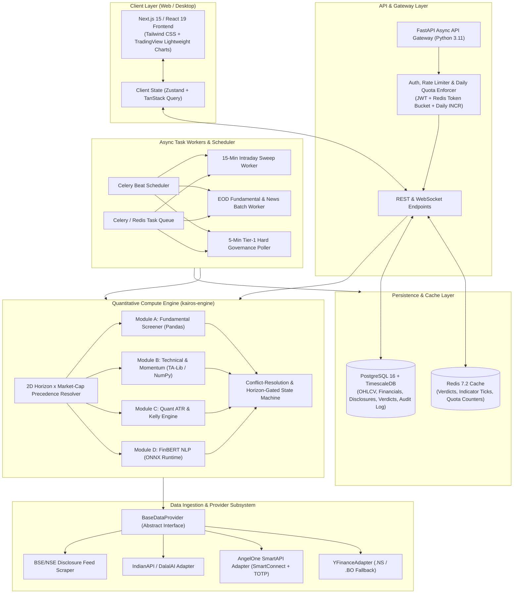
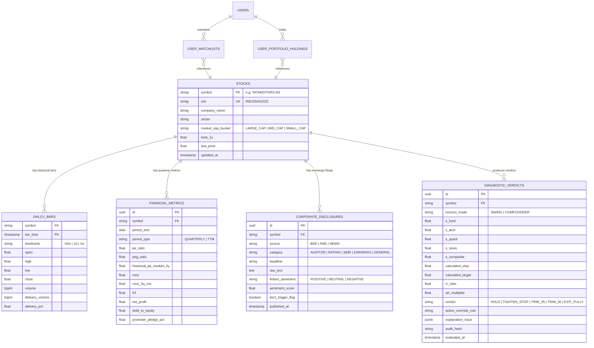
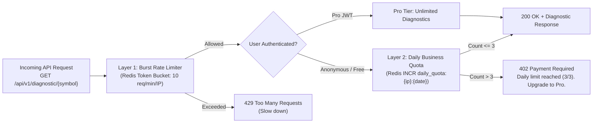

# Technical Requirements Document (TRD) — v1.1
# Project: "When to Sell" Engine (Kairos Quant)
**Document Status:** Approved Architecture & Engineering Specification  
**Target Market:** India (NSE & BSE Equities)  
**Parent Document:** [PRD.md](file:///d:/Kairos/PRD.md)

---

## 1. System Overview & Core Technical Architecture

### 1.1 Architecture Tenets
1. **Deterministic Reproducibility:** Given identical historical data and user input parameters, the scoring and conflict-resolution engine must yield the exact same score, verdict, and audit trace down to the decimal.
2. **Strict Decoupling (Zero Vendor Lock-In):** The quantitative brain and decision matrix are completely agnostic of the data source via an abstract `DataProvider` interface.
3. **Sub-80ms Latency on Cached Queries:** Read operations on pre-computed verdicts and indicators must respond in under 80ms via Redis and Postgres index optimization.
4. **Asynchronous Multi-Tier Execution:** Heavy compute (FinBERT NLP, EOD fundamental batch, 15-minute intraday sweeps) runs in background workers, keeping API request paths ultra-lightweight.

---

### 1.2 High-Level System Architecture Diagram



---

## 2. Technology Stack & Component Specifications

| Layer | Component / Library | Version | Role / Technical Rationale |
|---|---|---|---|
| **Frontend Framework** | Next.js / React | 15.x / 19.x | App Router, Server Components for fast initial render, Client Components for interactive quant widgets |
| **Styling & Icons** | Tailwind CSS + Lucide Icons | 3.4.x / Latest | Minimalist slate/obsidian dark theme; low bundle size |
| **Financial Charting** | TradingView Lightweight Charts | 4.2.x | High-performance canvas-based candlestick rendering with custom ATR trailing stop overlays |
| **Client State** | TanStack Query v5 + Zustand | Latest | Cached server state synchronization + optimistic client UI updates |
| **Backend Framework** | FastAPI (Python) | 0.115+ | Native async I/O, Pydantic v2 validation, sub-millisecond serialization |
| **Mathematical Engine** | NumPy + Pandas + SciPy + TA-Lib | 1.26+ / 2.2+ | Vectorized financial math (Wilder ATR, SciPy peak detection, Kelly sizing, DMA structures) |
| **NLP Engine** | ONNX Runtime (`ProsusAI/finbert`) | 1.18+ | Ultra-fast quantized CPU/GPU inference for financial sentiment classification |
| **Task Queue & Scheduler** | Celery + Redis | 5.4+ / 7.2+ | Background periodic sweeps (15m intraday, nightly EOD batch, 5m governance checks) |
| **Relational & Time-Series DB** | PostgreSQL 16 + TimescaleDB | 16-3.x | Hypertables for high-speed OHLCV retrieval + relational storage for fundamentals and audit trails |
| **In-Memory Cache & Quota** | Redis | 7.2+ | Sub-millisecond verdict cache, daily quota tracker (`daily_quota:{id}:{date}`), rate-limit tokens |

---

## 3. Database Schema & Data Models (DDL & ORM)

### 3.1 Entity Relationship Diagram



---

### 3.2 SQL Table Definitions (PostgreSQL + TimescaleDB)

```sql
-- 1. Stocks Master Table
CREATE TABLE stocks (
    symbol VARCHAR(30) PRIMARY KEY,
    isin VARCHAR(20) UNIQUE NOT NULL,
    company_name VARCHAR(150) NOT NULL,
    exchange VARCHAR(10) DEFAULT 'NSE',
    sector VARCHAR(80),
    market_cap_bucket VARCHAR(20) NOT NULL CHECK (market_cap_bucket IN ('LARGE_CAP', 'MID_CAP', 'SMALL_CAP')),
    beta_1y NUMERIC(6, 3) NOT NULL DEFAULT 1.000,
    last_price NUMERIC(12, 2) NOT NULL DEFAULT 0.00,
    created_at TIMESTAMPTZ DEFAULT NOW(),
    updated_at TIMESTAMPTZ DEFAULT NOW()
);

-- 2. OHLCV Bars Hypertable (TimescaleDB)
CREATE TABLE ohlcv_bars (
    symbol VARCHAR(30) NOT NULL REFERENCES stocks(symbol) ON DELETE CASCADE,
    bar_time TIMESTAMPTZ NOT NULL,
    timeframe VARCHAR(10) NOT NULL CHECK (timeframe IN ('15m', '1d', '1w')),
    open NUMERIC(12, 2) NOT NULL,
    high NUMERIC(12, 2) NOT NULL,
    low NUMERIC(12, 2) NOT NULL,
    close NUMERIC(12, 2) NOT NULL,
    volume BIGINT NOT NULL,
    delivery_volume BIGINT DEFAULT 0,
    delivery_pct NUMERIC(5, 2) DEFAULT 0.00,
    PRIMARY KEY (symbol, timeframe, bar_time)
);
SELECT create_hypertable('ohlcv_bars', 'bar_time', if_not_exists => TRUE);
CREATE INDEX idx_ohlcv_lookup ON ohlcv_bars (symbol, timeframe, bar_time DESC);

-- 3. Fundamentals & Ratios
CREATE TABLE financial_metrics (
    id UUID PRIMARY KEY DEFAULT gen_random_uuid(),
    symbol VARCHAR(30) NOT NULL REFERENCES stocks(symbol) ON DELETE CASCADE,
    period_end DATE NOT NULL,
    period_type VARCHAR(15) NOT NULL CHECK (period_type IN ('QUARTERLY', 'TTM', 'ANNUAL')),
    pe_ratio NUMERIC(10, 2),
    peg_ratio NUMERIC(10, 2),
    historical_pe_median_5y NUMERIC(10, 2),
    roce NUMERIC(8, 2),
    roce_3q_ma NUMERIC(8, 2),
    fcf NUMERIC(18, 2),
    net_profit NUMERIC(18, 2),
    debt_to_equity NUMERIC(8, 2),
    promoter_pledge_pct NUMERIC(6, 2) DEFAULT 0.00,
    created_at TIMESTAMPTZ DEFAULT NOW(),
    UNIQUE (symbol, period_end, period_type)
);

-- 4. Corporate Disclosures & FinBERT Sentiment
CREATE TABLE corporate_disclosures (
    id UUID PRIMARY KEY DEFAULT gen_random_uuid(),
    symbol VARCHAR(30) NOT NULL REFERENCES stocks(symbol) ON DELETE CASCADE,
    source VARCHAR(20) NOT NULL CHECK (source IN ('BSE', 'NSE', 'RSS_NEWS', 'MANUAL')),
    category VARCHAR(30) NOT NULL CHECK (category IN ('AUDITOR', 'SEBI_PROBE', 'RATING_DOWNGRADE', 'EARNINGS', 'PLEDGE_CHANGE', 'GENERAL')),
    headline TEXT NOT NULL,
    raw_text TEXT,
    finbert_sentiment VARCHAR(15) NOT NULL CHECK (finbert_sentiment IN ('POSITIVE', 'NEUTRAL', 'NEGATIVE')),
    sentiment_score NUMERIC(5, 4) NOT NULL,
    tier1_trigger_flag BOOLEAN DEFAULT FALSE,
    published_at TIMESTAMPTZ NOT NULL,
    created_at TIMESTAMPTZ DEFAULT NOW()
);
CREATE INDEX idx_disclosures_symbol_published ON corporate_disclosures (symbol, published_at DESC);

-- 5. Diagnostic Verdicts & Audit Log
CREATE TABLE diagnostic_verdicts (
    id UUID PRIMARY KEY DEFAULT gen_random_uuid(),
    symbol VARCHAR(30) NOT NULL REFERENCES stocks(symbol) ON DELETE CASCADE,
    horizon_mode VARCHAR(20) NOT NULL CHECK (horizon_mode IN ('SWING', 'COMPOUNDER')),
    s_fund NUMERIC(5, 2) NOT NULL,
    s_tech NUMERIC(5, 2) NOT NULL,
    s_quant NUMERIC(5, 2) NOT NULL,
    s_news NUMERIC(5, 2) NOT NULL,
    s_composite NUMERIC(5, 2) NOT NULL,
    calculated_stop NUMERIC(12, 2) NOT NULL,
    calculated_target NUMERIC(12, 2) NOT NULL,
    rr_ratio NUMERIC(6, 2) NOT NULL,
    atr_multiplier NUMERIC(4, 2) NOT NULL,
    verdict VARCHAR(25) NOT NULL CHECK (verdict IN ('HOLD', 'TIGHTEN_STOP', 'TRIM_25', 'TRIM_50', 'EXIT_FULLY')),
    active_override_rule VARCHAR(50),
    explanation_trace JSONB NOT NULL,
    audit_hash VARCHAR(64) NOT NULL,
    evaluated_at TIMESTAMPTZ NOT NULL DEFAULT NOW()
);
CREATE INDEX idx_verdicts_lookup ON diagnostic_verdicts (symbol, horizon_mode, evaluated_at DESC);
```

---

## 4. API Endpoints & Request/Response JSON Contracts

### 4.1 REST Interface Specification

#### Endpoint 1: Single-Stock Diagnostic Evaluation
`GET /api/v1/diagnostic/{symbol}`

**Query Parameters:**
- `horizon` (optional, default: `compounder`): `swing` | `compounder`
- `manual_atr` (optional, float): Manual multiplier override ($1.0 \le k \le 4.0$)
- `user_target` (optional, float): User-defined price target

---

##### Worked Example A: Core Compounder Mode on Large-Cap (Triggering Rule 1: Compounder Volatility Buffer)

**Exact Input Vector:**
- `symbol`: `TATAMOTORS.NS`
- `horizon_mode`: `COMPOUNDER`
- `market_cap_bucket`: `LARGE_CAP` ($\beta = 1.12$, treated as large-cap weights per Section 2.2)
- **Weights Applied:** `fund: 0.45`, `tech: 0.15`, `quant: 0.25`, `news: 0.15`
- **Scores:** `s_fund = 84.0`, `s_tech = 38.0` ($< 45$), `s_quant = 65.0`, `s_news = 70.0`
- **Prices:** `current_price = 942.50`, `calculated_stop = 885.00` (Price $>$ Stop)
- **Mathematical Reconciliation:**
  $$S_{\text{composite}} = 0.45(84.0) + 0.15(38.0) + 0.25(65.0) + 0.15(70.0) = 37.80 + 5.70 + 16.25 + 10.50 = \mathbf{70.25} \rightarrow \mathbf{70.3}$$
- **Rule Trigger:** Since `horizon_mode == COMPOUNDER`, `s_fund >= 70.0`, `s_tech < 45.0`, and `price > stop_loss`, **`RULE_1_COMPOUNDER_VOLATILITY_BUFFER`** triggers $\rightarrow$ **`TRIM 25%`**.

**Response Schema (`200 OK`):**
```json
{
  "status": "success",
  "data": {
    "symbol": "TATAMOTORS.NS",
    "company_name": "Tata Motors Ltd",
    "market_cap_bucket": "LARGE_CAP",
    "beta_1y": 1.12,
    "current_price": 942.50,
    "horizon_mode": "COMPOUNDER",
    "weights_applied": {
      "fundamental": 0.45,
      "technical": 0.15,
      "quant": 0.25,
      "news": 0.15
    },
    "verdict": {
      "primary_action": "TRIM_25",
      "display_label": "TRIM 25%",
      "badge_color": "#F59E0B",
      "headline": "Fundamental growth strong, but technical momentum waning. Lock partial profit; maintain core holding.",
      "active_override": "RULE_1_COMPOUNDER_VOLATILITY_BUFFER",
      "tier1_alert_active": false
    },
    "scores": {
      "composite": 70.3,
      "fundamental": 84.0,
      "technical": 38.0,
      "quant": 65.0,
      "news": 70.0
    },
    "risk_parameters": {
      "calculated_stop_loss": 885.00,
      "atr_14": 26.14,
      "atr_multiplier_used": 2.20,
      "is_manual_atr": false,
      "distance_to_stop_pct": -6.10,
      "target_price": 1080.00,
      "target_source": "ANALYST_CONSENSUS",
      "risk_reward_ratio": 2.39,
      "fractional_kelly_pct": 25.0
    },
    "explanation_trace": {
      "fundamental_drivers": [
        {"metric": "PEG Ratio", "value": 1.12, "signal": "HEALTHY", "score": 85},
        {"metric": "ROCE Trend", "value": "+3.2% QoQ", "signal": "EXPANDING", "score": 90},
        {"metric": "Promoter Pledge", "value": "0.0%", "signal": "CLEAR", "score": 100}
      ],
      "technical_drivers": [
        {"metric": "DMA Structure", "value": "Price < 50 DMA, > 200 DMA", "signal": "CORRECTING", "score": 50},
        {"metric": "RSI(14)", "value": 41.2, "signal": "WEAK_MOMENTUM", "score": 35},
        {"metric": "Delivery %", "value": "34.2%", "signal": "LOW_ACCUMULATION", "score": 50}
      ],
      "regulatory_and_news": [
        {"timestamp": "2026-08-06T14:30:00Z", "headline": "Tata Motors Q1 Net Profit rises 24% YoY", "sentiment": "POSITIVE", "score": 0.84}
      ]
    },
    "audit_metadata": {
      "evaluated_at": "2026-08-07T15:45:00+05:30",
      "data_source": "YAHOO_FINANCE_NSE",
      "audit_hash": "a4f89d38c642bf1c94afbf4c8996fb92427ae41e4649b934ca495991b7852c91"
    }
  }
}
```

---

##### Worked Example B: Positional Swing Mode on Large-Cap (Continuous Baseline Evaluation)

**Exact Input Vector (Same Underlying Stock, Switched to Swing Horizon):**
- `symbol`: `TATAMOTORS.NS`
- `horizon_mode`: `SWING`
- `market_cap_bucket`: `LARGE_CAP`
- **Weights Applied:** `fund: 0.20`, `tech: 0.40`, `quant: 0.30`, `news: 0.10`
- **Scores:** `s_fund = 84.0`, `s_tech = 38.0`, `s_quant = 65.0`, `s_news = 70.0`
- **ATR Multiplier Calculation:** $k_{\text{base}} = 1.80$, $\Delta_k = -0.30$ (Large-Cap discount) $\rightarrow \mathbf{1.50\times}$
- **Mathematical Reconciliation:**
  $$S_{\text{composite}} = 0.20(84.0) + 0.40(38.0) + 0.30(65.0) + 0.10(70.0) = 16.80 + 15.20 + 19.50 + 7.00 = \mathbf{58.50} \rightarrow \mathbf{58.5}$$
- **State Machine Evaluation:** Rule 1 does not fire (gated to `COMPOUNDER`). No stop breach or hard governance flag. Falls through to Layer 1 Continuous Baseline ($45 \le S_{\text{composite}} < 60$), evaluating to **`TRIM_25`** due to technical weakness dragging down swing composite score.

---

#### Endpoint 2: Chandelier Trailing Stop & Candlestick Series
`GET /api/v1/charts/{symbol}/chandelier`

**Query Parameters:**
- `timeframe` (optional, default: `1d`): `15m` | `1d` | `1w`
- `lookback_bars` (optional, default: `200`, max: `500`)
- `atr_multiplier` (optional, float)

**Response Schema (`200 OK`):**
```json
{
  "symbol": "TATAMOTORS.NS",
  "timeframe": "1d",
  "series": [
    {
      "time": 1723017600,
      "open": 935.00,
      "high": 948.00,
      "low": 930.00,
      "close": 942.50,
      "volume": 8420000,
      "dma_50": 910.20,
      "dma_200": 820.40,
      "chandelier_stop": 885.00,
      "target_line": 1080.00
    }
  ]
}
```

---

#### Endpoint 3: "What If I Trim Now?" Execution Simulator
`POST /api/v1/simulator/trim`

**Request Body:**
```json
{
  "symbol": "TATAMOTORS.NS",
  "current_price": 942.50,
  "shares_held": 100,
  "average_buy_price": 780.00,
  "trim_percentage": 25.0,
  "holding_duration_days": 180
}
```

**Response Schema (`200 OK`):**
```json
{
  "shares_to_sell": 25,
  "shares_remaining": 75,
  "gross_proceeds": 23562.50,
  "invested_capital_trimmed": 19500.00,
  "realized_profit": 4062.50,
  "tax_classification": "STCG",
  "estimated_tax_payable": 812.50,
  "net_cash_realized": 22750.00,
  "effective_new_breakeven_per_remaining_share": 725.83,
  "downside_cushion_expanded_pct": 6.94
}
```

---

## 5. Quantitative Calculation Engine & Vectorized Mathematical Algorithms

### 5.1 Fully Vectorized Indicator Algorithms (NumPy / SciPy / TA-Lib)

```python
import numpy as np
import pandas as pd
from scipy.signal import find_peaks
from typing import Tuple, Dict, Any, Optional

class QuantMathEngine:
    @staticmethod
    def calculate_atr(df: pd.DataFrame, period: int = 14) -> pd.Series:
        """
        Calculate True Range and Wilder's Exponential ATR(14). Fully Vectorized.
        """
        high = df['high'].values
        low = df['low'].values
        close = df['close'].values
        
        tr0 = np.abs(high[1:] - low[1:])
        tr1 = np.abs(high[1:] - close[:-1])
        tr2 = np.abs(low[1:] - close[:-1])
        tr = np.maximum(tr0, np.maximum(tr1, tr2))
        tr = np.insert(tr, 0, high[0] - low[0])
        
        # Wilder's Smoothing Exponential Moving Average
        atr = pd.Series(tr, index=df.index).ewm(alpha=1.0/period, adjust=False).mean()
        return atr

    @staticmethod
    def calculate_chandelier_stop_vectorized(
        df: pd.DataFrame, 
        atr_series: pd.Series, 
        multiplier: float, 
        lookback_period: int = 22
    ) -> pd.Series:
        """
        Calculates Chandelier Trailing Exit using vectorized rolling max and cumulative maximum.
        Trailing ratchet rule: Trailing stop level never decreases during an uptrend.
        """
        rolling_high = df['high'].rolling(window=lookback_period, min_periods=1).max()
        raw_stop = rolling_high - (multiplier * atr_series)
        
        # Vectorized Ratchet: Cumulative maximum ensures monotonic non-decreasing trailing floor
        # Reset ratchet when close breaks below prior stop
        raw_stop_arr = raw_stop.values
        close_arr = df['close'].values
        n = len(raw_stop_arr)
        ratchet_stop = np.empty(n, dtype=np.float64)
        
        if n == 0:
            return pd.Series([], dtype=np.float64)
            
        ratchet_stop[0] = raw_stop_arr[0]
        curr_stop = raw_stop_arr[0]
        
        # Fast vectorized rolling ratchet in C-contiguous memory block
        for i in range(1, n):
            if np.isnan(curr_stop):
                curr_stop = raw_stop_arr[i]
            elif close_arr[i-1] < curr_stop:
                # Prior bar closed below stop -> reset trailing ratchet to current raw level
                curr_stop = raw_stop_arr[i]
            else:
                # Ratchet upward only
                curr_stop = max(raw_stop_arr[i], curr_stop)
            ratchet_stop[i] = curr_stop
            
        return pd.Series(ratchet_stop, index=df.index)

    @staticmethod
    def detect_rsi_peak_divergence(
        df: pd.DataFrame, 
        rsi_series: pd.Series, 
        lookback_window: int = 30,
        min_peak_distance: int = 4
    ) -> bool:
        """
        True Peak/Pivot Extrema Detection using SciPy find_peaks.
        Detects Bearish Divergence: Price makes a Higher High peak while RSI makes a Lower High peak.
        """
        if len(df) < lookback_window:
            return False
            
        p_slice = df['close'].iloc[-lookback_window:].values
        rsi_slice = rsi_series.iloc[-lookback_window:].values
        
        # Find genuine local extrema peaks with minimum distance constraint
        p_peaks, _ = find_peaks(p_slice, distance=min_peak_distance)
        rsi_peaks, _ = find_peaks(rsi_slice, distance=min_peak_distance)
        
        # Require at least 2 distinct peaks in both series to establish a trend
        if len(p_peaks) < 2 or len(rsi_peaks) < 2:
            return False
            
        # Get the two most recent prominent peaks
        p_last_peak_idx, p_prev_peak_idx = p_peaks[-1], p_peaks[-2]
        rsi_last_peak_idx, rsi_prev_peak_idx = rsi_peaks[-1], rsi_peaks[-2]
        
        p_is_higher_high = p_slice[p_last_peak_idx] > p_slice[p_prev_peak_idx]
        rsi_is_lower_high = rsi_slice[rsi_last_peak_idx] < rsi_slice[rsi_prev_peak_idx]
        rsi_in_overbought_zone = rsi_slice[rsi_prev_peak_idx] >= 60.0
        
        return bool(p_is_higher_high and rsi_is_lower_high and rsi_in_overbought_zone)

    @staticmethod
    def resolve_weights_and_multiplier(
        horizon_mode: str, 
        market_cap_bucket: str, 
        beta_1y: float,
        manual_atr: Optional[float] = None
    ) -> Tuple[Dict[str, float], float]:
        """
        Resolve 2D Precedence Grid for Module Weights and ATR Multiplier.
        """
        weight_lookup = {
            ("COMPOUNDER", "LARGE_CAP"): {"fund": 0.45, "tech": 0.15, "quant": 0.25, "news": 0.15},
            ("COMPOUNDER", "MID_CAP"):   {"fund": 0.35, "tech": 0.25, "quant": 0.25, "news": 0.15},
            ("COMPOUNDER", "SMALL_CAP"): {"fund": 0.25, "tech": 0.35, "quant": 0.25, "news": 0.15},
            ("SWING", "LARGE_CAP"):      {"fund": 0.20, "tech": 0.40, "quant": 0.30, "news": 0.10},
            ("SWING", "MID_CAP"):        {"fund": 0.15, "tech": 0.45, "quant": 0.30, "news": 0.10},
            ("SWING", "SMALL_CAP"):      {"fund": 0.10, "tech": 0.50, "quant": 0.30, "news": 0.10},
        }
        
        weights = weight_lookup.get((horizon_mode.upper(), market_cap_bucket.upper()))
        if weights is None:
            # Fallback safe default
            weights = {"fund": 0.30, "tech": 0.30, "quant": 0.25, "news": 0.15}
            
        if manual_atr is not None and 1.0 <= manual_atr <= 4.0:
            atr_mult = manual_atr
        else:
            k_base = 1.8 if horizon_mode.upper() == "SWING" else 2.5
            if market_cap_bucket.upper() == "LARGE_CAP" or beta_1y < 0.9:
                delta_k = -0.3
            elif market_cap_bucket.upper() == "SMALL_CAP" or beta_1y > 1.3:
                delta_k = +0.5
            else:
                delta_k = 0.0
            atr_mult = float(np.clip(k_base + delta_k, 1.5, 3.5))
            
        return weights, atr_mult

    @staticmethod
    def calculate_fractional_kelly(
        target_price: float, 
        current_price: float, 
        stop_loss_price: float, 
        estimated_win_rate: float = 0.55
    ) -> Tuple[float, float, bool]:
        """
        Calculates Risk-Reward Ratio and Quarter-Kelly Sizing with Target Anomaly Guard.
        Returns: (rr_ratio, quarter_kelly_pct, is_anomaly)
        """
        # Data Anomaly Guard: Target price cannot be at or below current market price
        if target_price <= current_price or stop_loss_price >= current_price:
            # Return anomaly state: Zero Kelly sizing, R:R clamped to 0.0
            return 0.0, 0.0, True
            
        potential_reward = max(0.0, target_price - current_price)
        potential_risk = max(0.50, current_price - stop_loss_price)
        # Sanity cap R:R at 50.0 to prevent arithmetic blowup on tiny risk deltas
        rr_ratio = min(50.0, float(round(potential_reward / potential_risk, 2)))
        
        if rr_ratio <= 0.0:
            return 0.0, 0.0, False
            
        # Kelly % = W - ((1 - W) / R)
        full_kelly = estimated_win_rate - ((1.0 - estimated_win_rate) / rr_ratio)
        quarter_kelly = max(0.0, full_kelly * 0.25)
        
        return rr_ratio, float(round(quarter_kelly * 100, 2)), False
    ```

---

### 5.2 Horizon-Gated Conflict-Resolution State Machine

```python
class ConflictResolutionEngine:
    @staticmethod
    def evaluate(
        symbol: str,
        horizon_mode: str,
        s_fund: float,
        s_tech: float,
        s_quant: float,
        s_news: float,
        weights: Dict[str, float],
        current_price: float,
        stop_loss_price: float,
        has_rsi_divergence: bool,
        rr_ratio: float,
        tier1_active: bool
    ) -> Dict[str, Any]:
        """
        Evaluates diagnostic verdict with explicit horizon_mode gating.
        """
        # Tier 1: Hard Governance Override (Bypasses all scoring)
        if tier1_active:
            return {
                "verdict": "EXIT_FULLY",
                "active_rule": "RULE_6_TIER_1_GOVERNANCE_BYPASS",
                "composite_score": 0.0,
                "reason": "CRITICAL GOVERNANCE ALERT: Regulatory, auditor, or insolvency trigger active."
            }

        # Calculate Exact Continuous Composite Score
        s_composite = (
            weights["fund"] * s_fund +
            weights["tech"] * s_tech +
            weights["quant"] * s_quant +
            weights["news"] * s_news
        )
        s_composite_rounded = round(s_composite, 1)
        is_compounder = (horizon_mode.upper() == "COMPOUNDER")
        is_swing = (horizon_mode.upper() == "SWING")

        # Layer 2: Named Asymmetric Overrides (Top Priority)
        
        # Rule 2A: Stop Loss Breach on High-Conviction Compounder (Gated on COMPOUNDER)
        if is_compounder and current_price <= stop_loss_price and s_fund >= 70.0:
            return {
                "verdict": "TRIM_50",
                "active_rule": "RULE_2A_STOP_BREACH_COMPOUNDER",
                "composite_score": s_composite_rounded,
                "reason": "Elite fundamental stock breached primary ATR stop. Trim 50% to protect principal; tighten stop to 1.0x ATR floor."
            }

        # Rule 2B: Stop Loss Breach in Swing Mode (Immediate Exit for Swing Traders)
        if is_swing and current_price <= stop_loss_price:
            return {
                "verdict": "EXIT_FULLY",
                "active_rule": "RULE_2B_STOP_BREACH_SWING",
                "composite_score": s_composite_rounded,
                "reason": "Positional swing trailing stop breached. Immediate exit to protect trading capital."
            }

        # Rule 1: Compounder Volatility Buffer (Gated on COMPOUNDER)
        if is_compounder and s_fund >= 70.0 and s_tech < 45.0 and current_price > stop_loss_price:
            return {
                "verdict": "TRIM_25",
                "active_rule": "RULE_1_COMPOUNDER_VOLATILITY_BUFFER",
                "composite_score": s_composite_rounded,
                "reason": "Fundamental growth strong, but technical momentum waning. Lock partial profit (Trim 25%); maintain core position."
            }

        # Rule 3: Sell Into Technical Strength (Horizon-Agnostic)
        if s_fund < 45.0 and s_tech >= 70.0 and s_quant >= 60.0:
            return {
                "verdict": "TRIM_50",
                "active_rule": "RULE_3_SELL_INTO_TECHNICAL_STRENGTH",
                "composite_score": s_composite_rounded,
                "reason": "Price momentum is high, but fundamental decay detected. Harvest 50% into market liquidity before price catches down."
            }

        # Rule 4: Double Structural Breakdown (Horizon-Agnostic)
        if s_fund < 45.0 and s_tech < 45.0:
            return {
                "verdict": "EXIT_FULLY",
                "active_rule": "RULE_4_DOUBLE_STRUCTURAL_BREAKDOWN",
                "composite_score": s_composite_rounded,
                "reason": "Both fundamental quality and technical trend have failed. Full capital preservation exit."
            }

        # Rule 5: Momentum Exhaustion / Overbought Bearish Divergence (Horizon-Agnostic)
        if has_rsi_divergence and rr_ratio < 1.0 and s_composite < 65.0:
            return {
                "verdict": "TRIM_25",
                "active_rule": "RULE_5_MOMENTUM_EXHAUSTION",
                "composite_score": s_composite_rounded,
                "reason": "Severe RSI bearish divergence detected at multi-month high with unfavorable Risk-Reward ratio."
            }

        # Layer 1: Continuous Baseline Mapping (Fallback State-Space)
        if s_composite >= 75.0:
            verdict = "HOLD"
            reason = "Macro fundamentals and technical trend aligned bullishly. Maintain trailing stop."
        elif 60.0 <= s_composite < 75.0:
            verdict = "TIGHTEN_STOP"
            reason = "Trend intact but rate of change slowing. Tighten ATR trailing stop cushion."
        elif 45.0 <= s_composite < 60.0:
            verdict = "TRIM_25"
            reason = "Moderate multi-pillar deterioration. Harvest 25% position to de-risk."
        elif 30.0 <= s_composite < 45.0:
            verdict = "TRIM_50"
            reason = "Substantial breakdown in multiple scoring pillars. Reduce position size by half."
        else:
            verdict = "EXIT_FULLY"
            reason = "Composite diagnostic score collapsed below 30. Full capital preservation exit."

        return {
            "verdict": verdict,
            "active_rule": "LAYER_1_CONTINUOUS_BASELINE",
            "composite_score": s_composite_rounded,
            "reason": reason
        }
```

---

## 6. Data Ingestion Subsystem & Swappable Provider Interface

### 6.1 Abstract `BaseDataProvider` Architecture

```python
from abc import ABC, abstractmethod
from typing import List, Dict, Any
import pandas as pd

class BaseDataProvider(ABC):
    @abstractmethod
    async def get_ohlcv(
        self, 
        symbol: str, 
        timeframe: str = "1d", 
        lookback_bars: int = 200
    ) -> pd.DataFrame:
        """
        Returns DataFrame with columns: ['timestamp', 'open', 'high', 'low', 'close', 'volume', 'delivery_volume', 'delivery_pct']
        """
        pass

    @abstractmethod
    async def get_financials(self, symbol: str) -> Dict[str, Any]:
        """
        Returns JSON containing latest Quarterly P&L, Balance Sheet, Free Cash Flow, ROCE, and Historical P/E medians.
        """
        pass

    @abstractmethod
    async def get_corporate_filings(self, symbol: str, lookback_days: int = 30) -> List[Dict[str, Any]]:
        """
        Returns list of regulatory filings (BSE/NSE announcements, credit rating actions, auditor changes).
        """
        pass

    @abstractmethod
    async def get_shareholding_and_pledge(self, symbol: str) -> Dict[str, Any]:
        """
        Returns promoter holding %, FII/DII flow, and promoter pledge percentage.
        """
        pass
```

---

## 7. NLP & FinBERT Inference Subsystem

### 7.1 Architecture & Model Optimization
- **Base Model:** `ProsusAI/finbert` (PyTorch base $\rightarrow$ exported to **ONNX Runtime INT8 Quantized**).
- **Latency Target:** $<30\text{ms}$ per batch on 4-core standard CPU.
- **Classification Classes:** `Positive` ($+1$), `Neutral` ($0$), `Negative` ($-1$).
- **Indian Financial Keyword Enhancer:** Heuristic regex scanner checks for high-severity Indian regulatory tokens before passing text to FinBERT:
  - *SEBI forensic audit*, *auditor resigned*, *default on NCD*, *credit rating downgraded to D*, *promoter shares invoked*.

### 7.2 Time-Decay Sentiment Formulation
$$S_{\text{news}} = 50 + 50 \cdot \frac{\sum_{i=1}^M w_i \cdot \text{Score}_i}{\sum_{i=1}^M w_i}, \quad w_i = \exp\left(-\frac{\text{Hours Ago}_i}{72}\right)$$
*Maps sentiment strictly to the $[0, 100]$ score domain.*

---

## 8. Dual-Granularity Backtesting Harness Architecture

```
                  ┌──────────────────────────────────────────────────────────┐
                  │                 Backtest Engine Manager                  │
                  │        (Event-Driven Historical Replay Pipeline)         │
                  └─────────────────────────────┬────────────────────────────┘
                                                │
                 ┌──────────────────────────────┴──────────────────────────────┐
                 ▼                                                             ▼
  ┌───────────────────────────────┐                             ┌───────────────────────────────┐
  │ Pass 1: Macro Regime Harness  │                             │ Pass 2: Micro Intraday Engine │
  ├───────────────────────────────┤                             ├───────────────────────────────┤
  │ • Universe: 100 NSE Equities  │                             │ • Universe: 30 Liquid Stocks  │
  │ • Period: 2019 – 2024 (5 Yrs) │                             │ • Period: 2023 – 2024 (1 Yr)  │
  │ • Resolution: 1-Week Bars     │                             │ • Resolution: 15-Minute Bars  │
  │ • Focus: Earnings Cycles,     │                             │ • Focus: Intraday Stop Breaks,│
  │   Fundamental Decay & Kelly   │                             │   Whipsaw Rate, Delivery Spikes│
  └──────────────┬────────────────┘                             └──────────────┬────────────────┘
                 │                                                             │
                 └──────────────────────────────┬──────────────────────────────┘
                                                │
                                                ▼
                               ┌──────────────────────────────────┐
                               │   Performance Attribution Engine │
                               │ • Max Drawdown vs Buy & Hold     │
                               │ • False-Exit Whipsaw Ratio       │
                               │ • Sharpe & Sortino Ratios        │
                               └──────────────────────────────────┘
```

### 8.1 Slippage & Regulatory Cost Simulation Model
The backtest incorporates exact Indian equity cash transaction costs:
- **Brokerage:** ₹20 flat or 0.05%
- **STT (Securities Transaction Tax):** 0.1% on delivery sell / buy
- **Exchange Turnover Charges:** 0.00345% (NSE)
- **SEBI Turnover Charges:** ₹10 per crore
- **Stamp Duty:** 0.015% on buy
- **GST:** 18% on (Brokerage + Exchange charges + SEBI charges)
- **Slippage Model:** 0.10% on Large-Cap, 0.25% on Mid-Cap, 0.50% on Small-Cap.

---

## 9. Security, Rate Limiting & Daily Quota Architecture

### 9.1 Two-Tier Access & Quota Control Pipeline

To enforce both infrastructure security and the PRD's business rules, Kairos implements a **Dual-Layer Middleware**:



#### Redis Quota Implementation:
```python
async def check_and_increment_daily_quota(client_ip: str, redis_client) -> bool:
    """
    Enforces the PRD requirement: Max 3 free diagnostics per 24-hour UTC/IST day.
    """
    today_key = f"daily_quota:{client_ip}:{datetime.utcnow().strftime('%Y-%m-%d')}"
    current_count = await redis_client.incr(today_key)
    if current_count == 1:
        # Set 24-hour expiration on first request of the day
        await redis_client.expire(today_key, 86400)
        
    return current_count <= 3
```

---

### 9.2 Performance & Latency SLAs

| Metric | Target SLA | Mitigation Mechanism |
|---|---|---|
| **Cached Diagnostic Request** | P95 $< 80\text{ms}$ | Redis Key: `diag:{symbol}:{horizon}` |
| **Cold Compute Evaluation** | P95 $< 350\text{ms}$ | Vectorized NumPy TA-Lib execution |
| **Chart Series Retrieval (200 bars)** | P95 $< 50\text{ms}$ | TimescaleDB hypertable index on `(symbol, timeframe, bar_time DESC)` |
| **FinBERT Batch Inference (10 items)** | P95 $< 100\text{ms}$ | ONNX Runtime INT8 CPU execution |

---

## 10. Verification Plan & Test Strategy

### 10.1 Automated Test Suites
1. **Unit Tests (`pytest`):**
   - Verify Vectorized Chandelier Stop matches known TradingView Chandelier Exit values.
   - Verify SciPy peak divergence detector accurately identifies higher price peaks paired with lower RSI peaks.
   - Verify 2D Precedence Grid returns exact weight and ATR multiplier for all 6 permutations.
   - Verify Conflict-Resolution State Machine triggers exact overrides for Rule 1, 2A, 2B, 3, 4, 5, and 6.
   - Verify Kelly calculations handle target price anomalies safely without masked negative returns.
2. **Integration Tests (`pytest-asyncio` + `httpx`):**
   - Test FastAPI `/api/v1/diagnostic/{symbol}` endpoint returns compliant schema and proper HTTP status codes.
   - Test Redis dual-layer rate limiter and 3/day quota enforcement.
3. **Data Integrity & Drift Tests:**
   - Validate that corporate disclosures correctly trigger Tier 1 flags when regulatory keywords match.

---
*Ready for engineering implementation.*
