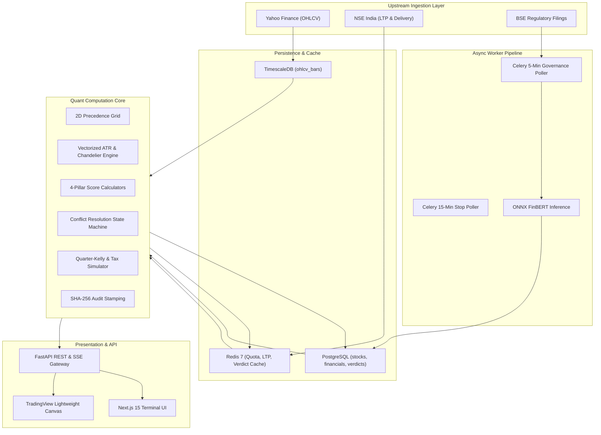

# Master Project Architecture & System Engineering Analysis
# Project: "When to Sell" Engine (Kairos Quant)

**Document Classification:** Comprehensive System Engineering Reference & Technical Architecture Blueprint  
**Target Audience:** Engineering Leads, Senior Quant Architects, Full-Stack Engineers, DevOps/MLOps Engineers  
**Source of Truth:** Single unified synthesis of [PRD.md](file:///d:/Kairos/PRD.md), [TRD.md](file:///d:/Kairos/TRD.md), [UI_UX.md](file:///d:/Kairos/UI_UX.md), [APP_FLOW.md](file:///d:/Kairos/APP_FLOW.md), [BACKEND_SCHEMA.md](file:///d:/Kairos/BACKEND_SCHEMA.md), [API.md](file:///d:/Kairos/API.md), and [AGENTS.md](file:///d:/Kairos/AGENTS.md).

---

## 1. Executive Summary

### 1.1 The Problem
In financial markets—specifically the Indian Equity Markets (NSE & BSE)—over 90% of retail and institutional research is exclusively focused on the **Buy decision** (stock screening, entry triggers, multi-bagger hunting). However, portfolio returns are almost entirely dictated by **Exit discipline**. Investors suffer from crippling cognitive biases:
- **The Disposition Effect & Loss Aversion:** Investors sell winning positions prematurely to lock in trivial gains (fearing profit erosion) while stubbornly holding decaying, losing positions into catastrophic drawdowns (hoping to "get back to even").
- **Analysis Paralysis & Conflict Confusion:** Investors face conflicting signals—e.g., strong quarterly earnings paired with sharp technical breakdowns, or massive technical rallies driven by speculative hype despite deteriorating balance sheets.
- **Tax and Friction Blindness:** Investors fail to realize the mathematical impact of partial profit locking, dynamic trailing stops, and Indian capital gains taxation (Short-Term Capital Gains at 20% vs. Long-Term Capital Gains at 12.5%).

### 1.2 The Target User
1. **Discretionary Indian Retail Investors & HNIs:** Holding 5 to 30 Indian cash equities across Zerodha, Groww, Upstox, or AngelOne, who need objective, emotion-free exit rules.
2. **Positional Swing Traders (Holding Days to Weeks):** Requiring tight volatility-adjusted trailing floors ($1.5\text{x}$–$2.2\text{x}$ ATR) to prevent giving back trend gains.
3. **Long-Term Multi-Year Compounders (Holding Months to Years):** Demanding wider fundamental buffers ($2.2\text{x}$–$3.5\text{x}$ ATR) that filter out transient intraday/intraweek market noise while aggressively cutting true structural deterioration.

### 1.3 The Overall Product Vision
**Kairos Quant** is an algorithmic, quantitative exit diagnostic terminal and automated downside protection engine designed specifically for Indian equities. It provides unambiguous, deterministic exit recommendations (**`HOLD`**, **`TIGHTEN_STOP`**, **`TRIM_25`**, **`TRIM_50`**, **`EXIT_FULLY`**) backed by mathematical explainability, dynamic Chandelier ratchet trailing stops, and cryptographic SEBI-compliant provenance hashing.

### 1.4 The Core Philosophy
- **"Never Ask Why When the Math Commands Action."**
- **Asymmetric Capital Preservation:** Downside protection takes absolute priority over upside speculation.
- **Strict Separation of Horizon & Capitalization:** A 2D Precedence Grid dynamically resolves weights and stops based on the investor's intended holding horizon and the stock's market capitalization bucket.
- **Complete Mathematical Explainability:** No black-box opacity. Every score is decomposed into explicit fundamental, technical, quantitative, and sentiment sub-drivers.

### 1.5 The Primary Value Proposition & Key Differentiators
| Dimension | Traditional Platforms (TradingView, Moneycontrol, Trendlyne) | Kairos Quant Terminal |
|---|---|---|
| **Core Objective** | Buy signals, stock screeners, price discovery | **Dedicated Algorithmic Sell & Exit Engine** |
| **Output Clarity** | Ambiguous multi-indicator charts ("Make your own call") | **Unambiguous Typographic Action Badge** (`TRIM 25%`, `EXIT FULLY`) |
| **Trailing Stop Architecture** | Static price levels or arbitrary percentages | **Monotonic Ratcheting Chandelier Volatility Floor** ($HH_{22} - m \cdot \text{ATR}_{14}$) |
| **Conflict Resolution** | Unresolved indicator collisions | **Deterministic 6-Rule Asymmetric Precedence Hierarchy** |
| **Monetization & Transparency** | Ad-bloated web pages or generic tips | **Clean Obsidian Terminal**, Frictionless 3 Scans/Day, Pro Unlimited |
| **Regulatory Compliance** | Unverified financial advice | **Deterministic SHA-256 SEBI Algorithmic Sandbox Provenance** |

---

## 2. Project Goals

### 2.1 Functional Goals
- **4-Pillar Quantitative Evaluation:** Synthesize Fundamental Health ($S_{\text{fund}}$), Technical Trend ($S_{\text{tech}}$), Volatility & Risk ($S_{\text{quant}}$), and Regulatory/News Sentiment ($S_{\text{news}}$) into a normalized $[0, 100]$ score space.
- **2D Precedence Grid Resolution:** Automatically map Horizon Mode (`COMPOUNDER` vs `SWING`) and Market Cap (`LARGE_CAP`, `MID_CAP`, `SMALL_CAP`) into bespoke module weighting profiles and ATR multipliers.
- **6 Asymmetric Override Rules & Tier-1 Emergency Bypass:** Force decisive overrides for auditor resignations, regulatory probes, severe bearish RSI divergence, and structural breakdown.
- **Interactive "What If I Trim Now?" Simulator:** Real-time calculation of gross proceeds, Indian tax liability (STCG 20% vs LTCG 12.5%), net cash realized, and the exact downward expansion of the breakeven cushion on retained shares.
- **Interactive TradingView Lightweight Charts Canvas:** Live candlestick chart overlaid with 50/200 DMAs and the ratcheting Chandelier trailing-stop floor line.

### 2.2 Business Goals
- **Top-of-Funnel Conversion:** Frictionless anonymous access allowing 3 high-conviction diagnostic scans per 24-hour day (tracked via IP and browser fingerprint).
- **Pro Monetization Engine:** Conversion to paid subscription (₹799/month or ₹7,999/year) via Razorpay, unlocking unlimited scans, multi-stock portfolio heatmaps, and automated WhatsApp/SMS stop breach alerts.
- **Viral Proof & Distribution:** Instant one-click clipboard copying of diagnostic audit cards and SEBI SHA-256 provenance proof for social sharing on X/Twitter and financial forums.

### 2.3 Technical Goals
- **Strict Determinism:** Identical input vectors must produce bit-for-bit identical diagnostic outputs, scores, and SHA-256 audit hashes.
- **Ultra-Low Latency SLAs:**
  - Cached diagnostic retrieval: P95 $< 80\text{ms}$.
  - Cold computation on fresh market data: P95 $< 350\text{ms}$.
  - Autocomplete search across 2,000+ NSE/BSE tickers: P95 $< 30\text{ms}$.
  - Chart series rendering (200 daily/15m bars): P95 $< 50\text{ms}$.
- **Zero-`any` TypeScript & Strict Static Python Typing:** Full contract alignment from database hypertable schemas up to React 19 presentation components.

### 2.4 Long-Term Scalability Goals
- Handle 50,000+ daily diagnostic evaluations with horizontal worker scaling (Celery / Redis / TimescaleDB).
- Support automated continuous market ingestion for the entire NSE/BSE liquid universe (Nifty 500 + BSE 500).

---

## 3. External Dependencies

### 3.1 External APIs & Data Feeds
| Provider / Source | Purpose | Data Acquired | Criticality | Fallback Strategy |
|---|---|---|---|---|
| **Yahoo Finance (`yfinance`)** | Historical & Intraday OHLCV Price Feed | Daily/15m/1w OHLCV bars, Split/Dividend adjustments | **Mandatory** | Secondary NSE API / Stale-While-Revalidate Cache |
| **NSE India Official Feed / Scraping** | Live Market Depth & Delivery Data | Last Traded Price (LTP), Security-wise Delivery %, F&O Lot Sizes | **Mandatory (Live)** | 20-period historical rolling average delivery fallback |
| **AngelOne SmartAPI (`smartapi-python`)** | Free Broker API for Real-Time SmartStream Ticks, WebSocket LTP & Historical OHLCV | Live Ticks, Intraday Candlesticks, Multi-factor TOTP login | **Production Feed** | `yfinance` + NSE Live Scraper Fallback |
| **BSE / NSE Corporate Announcements** | Regulatory Filings & News Feed | Board meetings, credit ratings, SEBI orders, auditor changes | **Mandatory (Governance)** | Direct RSS scraping & periodic pollers |
| **Razorpay Payments API** | Subscription Lifecycle & Billing | Webhooks, Checkout Orders, Customer Recurring Subscriptions | **Mandatory (Monetization)** | Free-tier daily quota fallback |
| **Fast2SMS / Gupshup / WhatsApp API** | Pro User Alerts (Phase 3) | Stop-loss breach notifications & weekly digest | **Optional (Pro)** | Web dashboard badge & email notification |

### 3.2 Core Backend Libraries (`kairos-engine`)
- **`fastapi` (v0.115+) & `uvicorn`:** High-performance asynchronous REST and SSE/WebSocket framework.
- **`sqlalchemy` (v2.0+) & `asyncpg`:** Asynchronous Object Relational Mapping and raw SQL execution for PostgreSQL/TimescaleDB.
- **`redis-py` (v5.0+):** Asynchronous connection pool for Token Bucket rate-limiting, daily scan quotas, and diagnostic response caching.
- **`numpy` & `scipy`:** Vectorized mathematical routines, array slicing, and `scipy.signal.find_peaks` for peak-divergence detection.
- **`pandas`:** Time-series alignment, rolling moving averages, exponential Wilder smoothing.
- **`onnxruntime` (INT8):** Sub-30ms CPU-optimized machine learning inference for FinBERT financial sentiment.
- **`transformers` / `tokenizers`:** HuggingFace tokenization pipeline for input disclosure text preprocessing.
- **`celery` & `redis`:** Distributed background task queue for periodic market sweeps and nightly EOD aggregation.
- **`pydantic` (v2.0+):** Runtime type validation, deserialization, and JSON schema contract generation.
- **`cryptography` / `hashlib`:** Deterministic canonical JSON serialization and SHA-256 SEBI audit hashing.

### 3.3 Core Frontend Libraries (`kairos-web`)
- **`next` (v15.0+ / React 19):** Full-stack App Router framework with Server Components and Server Actions.
- **`@tradingview/lightweight-charts` (v4.2+):** High-performance HTML5 canvas financial charting library for candlestick and trailing-stop rendering.
- **`tailwindcss` (v3.4+):** Utility-first styling engine mapped strictly to the terminal obsidian palette.
- **`lucide-react`:** Monochromatic terminal UI iconography.
- **`zod`:** Client-side form and API payload schema validation.

### 3.4 Infrastructure & Cloud Topology
- **Primary Database:** PostgreSQL 16 with **TimescaleDB** extension for high-performance time-series partitioning and chunk compression on `ohlcv_bars`.
- **In-Memory Cache & Message Broker:** **Redis 7.2** (configured with `appendonly yes` and LRU eviction).
- **Background Worker & Scheduler:** **Celery + Celery Beat** running on dedicated worker containers.
- **Web Application Hosting:** Next.js deployed on Vercel / Node.js Edge, FastAPI backend running on Docker container instances behind Nginx / Cloudflare.

### 3.5 AI & Machine Learning Models
- **Model Name:** `ProsusAI/finbert` (Financial Sentiment BERT).
- **Optimization:** PyTorch weights exported to **ONNX Runtime INT8 Quantized** model format.
- **Inference Target:** Local CPU execution (P95 $< 30\text{ms}$ per batch of 10 filings).
- **Output Dimensions:** 3-class probability distribution: `Positive` ($+1$), `Neutral` ($0$), `Negative` ($-1$).
- **Limitations:** Does not process audio/visual earnings calls; requires sanitized text extraction from PDF/HTML filings.

---

## 4. Backend Architecture

```
kairos-engine/
├── app/
│   ├── api/                      # API Layer (Routers & Middleware)
│   │   ├── v1/
│   │   │   ├── router.py         # Primary API v1 Router aggregator
│   │   │   ├── diagnostic.py     # Evaluation & SSE Streaming routes
│   │   │   ├── charts.py         # Candlestick & Chandelier series routes
│   │   │   ├── simulator.py      # Trim & Tax simulation routes
│   │   │   ├── stocks.py         # Search & Autocomplete routes
│   │   │   ├── watchlist.py      # User portfolio & watchlist routes
│   │   │   ├── payments.py       # Razorpay orders & webhook ingestion
│   │   │   └── audit.py          # SHA-256 Provenance verification routes
│   │   └── dependencies.py       # Auth (JWT), Quota, DB Session, Redis injections
│   │
│   ├── core/                     # Infrastructure Configuration & Security
│   │   ├── config.py             # Pydantic Settings (Environment variables)
│   │   ├── database.py           # SQLAlchemy Async Engine & Sessionmaker
│   │   ├── redis_client.py       # Redis connection pool & helper methods
│   │   ├── quota.py              # Dual-Layer Rate Limiting & Daily Quota engine
│   │   └── security.py           # JWT creation/verification & bcrypt password hashing
│   │
│   ├── db/                       # Database Management & Seeding
│   │   ├── migrations/           # Alembic revision scripts
│   │   └── seed.py               # Canonical stock metadata & historical baseline seeds
│   │
│   ├── models/                   # SQLAlchemy 2.0 ORM Models
│   │   ├── base.py               # Declarative Base
│   │   ├── stock.py              # stocks master table
│   │   ├── market_data.py        # ohlcv_bars (TimescaleDB) & financial_metrics
│   │   ├── corporate.py          # corporate_disclosures table
│   │   ├── verdict.py            # diagnostic_verdicts table
│   │   └── user.py               # users, subscriptions, user_watchlists
│   │
│   ├── schemas/                  # Pydantic v2 Serialization Contracts
│   │   ├── enums.py              # HorizonMode, MarketCapBucket, PrimaryAction, etc.
│   │   ├── diagnostic.py         # DiagnosticRequest, DiagnosticResponse, VerdictSchema
│   │   ├── charts.py             # ChartSeriesResponse, BarData
│   │   ├── simulator.py          # TrimSimulationRequest, TrimSimulationResponse
│   │   └── api.py                # Generic APIResponse[T], ErrorResponse
│   │
│   ├── engine/                   # Pure Quant Math & Rules (Domain Layer)
│   │   ├── evaluator.py          # Master Orchestrator (evaluate_diagnostic)
│   │   ├── indicators.py         # Wilder ATR, Chandelier Ratchet, SciPy RSI Divergence
│   │   ├── precedence_grid.py    # 2D Grid Weights & Dynamic ATR Multipliers
│   │   ├── module_a_fundamental.py # Fundamental Health Scoring ($S_{\text{fund}}$)
│   │   ├── module_b_technical.py   # Technical Trend Scoring ($S_{\text{tech}}$)
│   │   ├── module_c_quant.py       # Volatility & Drawdown Scoring ($S_{\text{quant}}$)
│   │   ├── module_d_sentiment.py   # Time-Decayed FinBERT Scoring ($S_{\text{news}}$)
│   │   ├── conflict_resolution.py  # 6 Override Rules & Tier-1 Emergency Bypass
│   │   ├── risk_sizing.py        # Quarter-Kelly & Risk-Reward algorithms
│   │   ├── tax_simulator.py      # Indian STCG/LTCG capital gains calculator
│   │   └── audit_hash.py         # SHA-256 SEBI Provenance Stamping
│   │
│   ├── services/                 # External Ingestion & Data Providers
│   │   ├── base_provider.py      # Abstract BaseDataProvider interface
│   │   ├── yfinance_provider.py  # Yahoo Finance real-time & historical adapter
│   │   ├── nse_provider.py       # NSE India live quote & delivery scraper
│   │   ├── nlp_inference.py      # ONNX Runtime FinBERT model runner
│   │   └── market_data_service.py # Orchestrates DB caching + upstream fallback
│   │
│   └── workers/                  # Background Schedulers & Tasks
│       ├── celery_app.py         # Celery instance configuration
│       ├── intraday_sweep.py     # 15-min trailing stop breach poller
│       ├── governance_poller.py  # 5-min BSE/NSE regulatory announcement crawler
│       └── eod_batch.py          # Nightly EOD fundamental & price reconciliation
│
└── tests/                        # Comprehensive Pytest Suite
    ├── test_math_indicators.py   # Wilder ATR & Chandelier ratchet accuracy tests
    ├── test_divergence.py        # SciPy RSI peak-divergence tests
    ├── test_precedence_grid.py   # 2D Precedence matrix permutation tests
    ├── test_conflict_rules.py    # 6 Override rules & Tier-1 bypass tests
    ├── test_tax_simulator.py     # Indian STCG/LTCG tax math tests
    └── test_api_integration.py   # Full FastAPI HTTP/SSE endpoint tests
```

---

## 5. Backend Request Flow: Complete End-to-End Trace

### Real-World Example: User Diagnoses "TCS.NS"

```
[Browser Client]
       │
       ▼ (1) GET /api/v1/diagnostic/TCS.NS?horizon_mode=COMPOUNDER
[Layer 1: Burst Rate Limiter (Redis)]
       │  ↳ Checks token bucket (10 req/min/IP) ───[Exceeded]──► 429 Too Many Requests
       ▼ (Allowed)
[Layer 2: Daily Quota Enforcement (Redis)]
       │  ↳ Checks JWT Pro status OR increment daily_quota:{ip}:{date}
       │  ↳ If Anonymous & Count > 3 ────────────[Exceeded]──► 402 Payment Required
       ▼ (Allowed, Remaining: 2)
[Diagnostic Controller / Router]
       │  ↳ Validates symbol and query parameters via Pydantic schemas
       ▼
[Market Data Orchestrator Service]
       │  ↳ Checks Redis Cache: cache:diagnostic:TCS.NS:COMPOUNDER
       │  ↳ [Cache Hit] ─────────────────────────────────────► Return 200 OK
       │  ↳ [Cache Miss] ──► Queries PostgreSQL/TimescaleDB
       │  ↳ Checks if local OHLCV/Financials are fresh (within 15m)
       │  ↳ If stale/missing ──► Fetches live data via YFinance/NSE Data Provider
       │  ↳ Persists fresh bars & financials to TimescaleDB
       ▼
[Pure Quant Engine: Evaluator]
       │  1. Ingests 200 daily OHLCV bars, financial ratios, disclosures.
       │  2. Resolves 2D Precedence Grid:
       │     - TCS.NS is LARGE_CAP + COMPOUNDER
       │     - Weights: Fund 45%, Tech 15%, Quant 25%, News 15%
       │     - Multiplier: k = 2.5 - 0.3 = 2.2x ATR
       │  3. Vectorized Math Engine:
       │     - Wilder ATR(14) = ₹82.40
       │     - Rolling HH(22) = ₹4,250.00
       │     - Chandelier Stop = 4250 - (2.2 * 82.40) = ₹4,068.72 (Ratcheted)
       │     - SciPy RSI(14) Peak Divergence = False
       │  4. Module Scoring Calculators:
       │     - S_fund = 88.0 (Low debt, ROCE 45%, PEG 1.8)
       │     - S_tech = 62.0 (Above 200 DMA, near 50 DMA)
       │     - S_quant = 75.0 (Low beta 0.75, mild drawdown)
       │     - S_news = 70.0 (Positive client wins, zero SEBI probes)
       │  5. Continuous Composite Calculation:
       │     - S_composite = 0.45(88) + 0.15(62) + 0.25(75) + 0.15(70) = 78.15 -> 78.2
       │  6. Conflict-Resolution State Machine:
       │     - Tier 1 active? No.
       │     - Current Price (₹4,120) <= Stop (₹4,068.72)? No.
       │     - Rule 1 / Rule 3 / Rule 4 / Rule 5 triggered? No.
       │     - Layer 1 Continuous Baseline: S_composite >= 75.0 ──► VERDICT = "HOLD"
       │  7. Risk Sizing & Fractional Kelly:
       │     - Analyst Consensus Target = ₹4,650.00
       │     - Potential Reward = ₹530.00 | Potential Risk = ₹51.28
       │     - Risk-Reward Ratio = 10.33:1 | Quarter-Kelly Allocation = 25.0%
       │  8. Cryptographic SHA-256 Provenance Stamping:
       │     - Ingests canonical JSON payload + salt
       │     - Produces deterministic 64-char hex audit hash
       ▼
[Persistence & Cache Layer]
       │  ↳ Asynchronously saves verdict record to diagnostic_verdicts table
       │  ↳ Caches JSON payload in Redis (TTL: 15m market hours / 24h off-market)
       ▼
[Response Builder]
       │  ↳ Attaches X-Audit-Hash, X-RateLimit, X-Daily-Quota headers
       ▼ (200 OK JSON Payload)
[Next.js 15 Client Terminal]
       │  ↳ Renders Typographic Action Badge ("HOLD")
       │  ↳ Plots Chandelier floor line on TradingView canvas
       │  ↳ Populates 4-pillar Diagnostic Ledger and Audit Proof Modal
```

---

## 6. Data Flow Architecture



### Detailed Dataset Lifecycle
1. **OHLCV Bars:** Originates at Yahoo Finance / NSE $\rightarrow$ Transformed via Pandas/NumPy into continuous daily/15m/1w series $\rightarrow$ Stored in TimescaleDB `ohlcv_bars` hypertable $\rightarrow$ Cached in Redis $\rightarrow$ Consumed by Indicator Engine and TradingView Canvas.
2. **Financial Metrics:** Originates at Quarterly Corporate Filings / Screener $\rightarrow$ Validated via Pydantic $\rightarrow$ Stored in `financial_metrics` $\rightarrow$ Consumed by Module A ($S_{\text{fund}}$).
3. **Regulatory Announcements & News:** Originates at BSE/NSE RSS $\rightarrow$ Classified by ONNX FinBERT $\rightarrow$ Stored in `corporate_disclosures` $\rightarrow$ Consumed by Module D ($S_{\text{news}}$) and Tier-1 Hard Governance Bypass.
4. **Verdicts & Proof Hashes:** Generated deterministically by Quant Engine $\rightarrow$ Stored in `diagnostic_verdicts` $\rightarrow$ Broadcasted via REST/SSE to Frontend Terminal.

---

## 7. Business Logic & Quantitative Rules

### 7.1 The 4 Diagnostic Pillar Scoring Formulations
1. **Fundamental Health ($S_{\text{fund}} \in [0, 100]$):**
   - Evaluates PEG ratio ($<1.0 \rightarrow 100$, $>2.5 \rightarrow 20$), ROCE trend vs. 3-quarter moving average, Free Cash Flow to Net Profit ratio ($\ge 0.8 \rightarrow 100$), Debt-to-Equity ($<0.5 \rightarrow 100$), and Promoter Pledge ($\ge 20\% \rightarrow 0$).
2. **Technical Trend ($S_{\text{tech}} \in [0, 100]$):**
   - Evaluates price position relative to 50 DMA and 200 DMA, 14-period RSI momentum band, and Security Delivery % ($>40\% \rightarrow 100$).
3. **Volatility & Risk ($S_{\text{quant}} \in [0, 100]$):**
   - Evaluates 52-week high drawdown ($>-5\% \rightarrow 100$, $<-30\% \rightarrow 10$) and 1-year annualized realized volatility.
4. **Regulatory & Sentiment ($S_{\text{news}} \in [0, 100]$):**
   - Time-decayed exponential aggregation of FinBERT disclosure sentiment:
     $$S_{\text{news}} = 50 + 50 \cdot \frac{\sum_{i=1}^M w_i \cdot \text{Score}_i}{\sum_{i=1}^M w_i}, \quad w_i = \exp\left(-\frac{\text{Hours Ago}_i}{72}\right)$$

### 7.2 The 2D Precedence Grid Matrix
The engine dynamically switches weights and ATR multipliers based on investor horizon and market capitalization:

| Horizon Mode | Market Cap Bucket | $w_{\text{fund}}$ | $w_{\text{tech}}$ | $w_{\text{quant}}$ | $w_{\text{news}}$ | Base Multiplier ($k$) | Net Multiplier ($m$) |
|---|---|---|---|---|---|---|---|
| **COMPOUNDER** | **LARGE_CAP** | **0.45** | 0.15 | 0.25 | 0.15 | $2.5\times$ | **$2.2\times$ ATR** |
| **COMPOUNDER** | **MID_CAP** | **0.35** | 0.25 | 0.25 | 0.15 | $2.5\times$ | **$2.5\times$ ATR** |
| **COMPOUNDER** | **SMALL_CAP** | **0.25** | 0.35 | 0.25 | 0.15 | $2.5\times$ | **$3.0\times$ ATR** |
| **SWING** | **LARGE_CAP** | 0.20 | **0.40** | 0.30 | 0.10 | $1.8\times$ | **$1.5\times$ ATR** |
| **SWING** | **MID_CAP** | 0.15 | **0.45** | 0.30 | 0.10 | $1.8\times$ | **$1.8\times$ ATR** |
| **SWING** | **SMALL_CAP** | 0.10 | **0.50** | 0.30 | 0.10 | $1.8\times$ | **$2.3\times$ ATR** |

### 7.3 The 6 Asymmetric Conflict-Resolution Rules
1. **Rule 6 (Tier-1 Hard Governance Emergency Bypass):** Active SEBI fraud probe, auditor resignation, or debt default immediately overrides all calculations $\rightarrow$ **`EXIT FULLY`** ($S_{\text{composite}} = 0.0$).
2. **Rule 2A (Stop Breach on High-Conviction Compounder):** If `COMPOUNDER` and $\text{Price} \le \text{Stop}$ and $S_{\text{fund}} \ge 70.0 \rightarrow$ **`TRIM 50%`** (preserves half position, resets stop to $1.0\times$ ATR).
3. **Rule 2B (Stop Breach on Swing Position):** If `SWING` and $\text{Price} \le \text{Stop} \rightarrow$ **`EXIT FULLY`** (immediate capital preservation).
4. **Rule 1 (Compounder Volatility Buffer):** If `COMPOUNDER` and $S_{\text{fund}} \ge 70.0$ and $S_{\text{tech}} < 45.0$ and $\text{Price} > \text{Stop} \rightarrow$ **`TRIM 25%`** (locks partial profit while holding core).
5. **Rule 3 (Sell Into Technical Strength):** If $S_{\text{fund}} < 45.0$ and $S_{\text{tech}} \ge 70.0$ and $S_{\text{quant}} \ge 60.0 \rightarrow$ **`TRIM 50%`** (harvests liquidity before price collapses).
6. **Rule 4 (Double Structural Breakdown):** If $S_{\text{fund}} < 45.0$ and $S_{\text{tech}} < 45.0 \rightarrow$ **`EXIT FULLY`**.
7. **Rule 5 (Momentum Exhaustion / Overbought Bearish Divergence):** If SciPy detects bearish RSI peak divergence and $R:R < 1.0$ and $S_{\text{composite}} < 65.0 \rightarrow$ **`TRIM 25%`**.

### 7.4 Layer 1 Continuous Baseline State Space
When no named override rule fires, the engine maps continuous composite score $S_{\text{composite}}$ directly to actions:
- $S_{\text{composite}} \ge 75.0 \rightarrow$ **`HOLD`** (Emerald Glow, `#10B981`)
- $60.0 \le S_{\text{composite}} < 75.0 \rightarrow$ **`TIGHTEN_STOP`** (Cyan Glow, `#06B6D4`)
- $45.0 \le S_{\text{composite}} < 60.0 \rightarrow$ **`TRIM_25`** (Amber Glow, `#F59E0B`)
- $30.0 \le S_{\text{composite}} < 45.0 \rightarrow$ **`TRIM_50`** (Orange Glow, `#F97316`)
- $S_{\text{composite}} < 30.0 \rightarrow$ **`EXIT_FULLY`** (Coral Crimson Glow, `#EF4444`)

### 7.5 Position Sizing & Quarter-Kelly Allocation
$$f^* = \frac{W \cdot R - (1 - W)}{R}, \quad f_{\text{Quarter-Kelly}} = \max\left(0, 0.25 \cdot f^*\right)$$
Where $W = 0.55$ (estimated empirical win rate) and $R = \frac{\text{Target Price} - \text{Current Price}}{\max(0.50, \text{Current Price} - \text{Stop Loss})}$.

### 7.6 Indian Equity Capital Gains Tax Simulator
- **Short-Term Capital Gains (STCG, Holding $\le 365$ Days):** Flat **20.0%** tax on realized gains.
- **Long-Term Capital Gains (LTCG, Holding $> 365$ Days):** Flat **12.5%** tax on gains exceeding the statutory ₹1,25,000 exemption limit.
- **New Effective Breakeven Calculation:**
  $$\text{Effective Breakeven} = \frac{(\text{Total Shares} \cdot \text{Buy Price}) - \text{Net Cash Added}}{\text{Remaining Shares}}$$

---

## 8. User Flow Architecture & Decision States

```
[Public Visitor]
       │
       ▼
[Landing Hero (/)] ──► Live Autocomplete Search ("TATAMOTORS", "RELIANCE", "TCS")
       │
       ▼ (Selects Ticker)
[Diagnostic Terminal (/diagnostic/[symbol])]
       │
       ├─► [Check Daily Quota (Redis)]
       │      ├─► [Quota Available (<= 3/day)] ──► Renders Terminal Dashboard
       │      └─► [Quota Exhausted (4th scan)]  ──► Triggers Pro Upgrade Paywall Modal
       │
       ├─► [Interactive Horizon Toggle]
       │      ├─► Switch to "COMPOUNDER" ──► Recomputes weights (45% Fund), ATR 2.2x
       │      └─► Switch to "SWING"      ──► Recomputes weights (40% Tech), ATR 1.5x
       │
       ├─► [Interactive TradingView Chart Canvas]
       │      ├─► Switch Timeframe: 15m | 1D | 1W
       │      └─► Adjust ATR Multiplier Slider (1.0x to 4.0x)
       │
       ├─► [Interactive "What If I Trim Now?" Simulator]
       │      ├─► Input Buy Price, Quantity, Holding Months
       │      └─► Live recalculation of STCG/LTCG tax, net cash, and expanded cushion
       │
       ├─► [SEBI Provenance Proof Modal]
       │      ├─► Inspect SHA-256 hash, raw inputs, and SEBI compliance statement
       │      └─► One-click copy proof to clipboard
       │
       └─► [Portfolio Watchlist Drawer]
              ├─► Save stock to private watchlist (Local/JWT session)
              └─► Real-time tracking of distance-to-stop floor
```

### Error & Edge States
- **Delisted / Invalid Ticker:** Returns `404 Not Found` with suggestions of active NSE tickers.
- **Insufficient Historical Bars ($< 14$ days):** Gracefully falls back to IPO mode with widened ATR bands.
- **Missing Quarterly Financials:** Flags $S_{\text{fund}}$ with a data warning badge and re-allocates missing weight to $S_{\text{tech}}$ and $S_{\text{quant}}$.
- **Upstream Network Failure:** Transparently serves cached stale evaluation with an `OUTDATED_CACHE` header badge.

---

## 9. System Components Specification

### 9.1 Data Ingestion Subsystem (`app/services/`)
- **`BaseDataProvider`:** Abstract base class defining `get_ohlcv()`, `get_financials()`, `get_corporate_filings()`, `get_shareholding_and_pledge()`.
- **`YFinanceProvider`:** Fetches continuous multi-timeframe OHLCV bars with split/dividend reconciliation.
- **`NSEProvider`:** Ingests live security delivery percentages and F&O lot sizes.
- **`NLPInferenceService`:** Loads ONNX `ProsusAI/finbert` INT8 model and runs tokenized batched inference.

### 9.2 Quantitative Math Engine (`app/engine/`)
- **`QuantMathEngine` (`indicators.py`):** Pure NumPy/SciPy implementations of Wilder ATR, monotonic Chandelier ratchet, and peak divergence.
- **`PrecedenceGridEngine` (`precedence_grid.py`):** Resolves the 6-permutation 2D weight matrix and ATR multipliers.
- **`ConflictResolutionEngine` (`conflict_resolution.py`):** Deterministic state machine evaluating the 6 Named Asymmetric Overrides and Tier-1 Emergency Bypass.
- **`TaxAndTrimSimulator` (`tax_simulator.py`):** Computes Indian STCG/LTCG tax liability and breakeven cushion expansion.
- **`AuditProvenanceService` (`audit_hash.py`):** Generates RFC-compliant SHA-256 cryptographic proof hashes.

### 9.3 Asynchronous Worker Engine (`app/workers/`)
- **`IntradaySweepWorker`:** 15-minute Celery cron scanning all user watchlists for trailing-stop breaches.
- **`GovernancePollerWorker`:** 5-minute Celery cron parsing exchange regulatory announcements for Tier-1 triggers.
- **`EODReconciliationWorker`:** Daily 18:00 IST cron updating corporate financial ratios and 52-week metrics.

### 9.4 Terminal UI Component Hierarchy (`kairos-web/src/components/`)
- **`TerminalHeader`:** Ticker symbol, company name, live LTP, market cap badge, and instant search bar.
- **`TypographicVerdict`:** Massive monospace action badge (`HOLD`, `TRIM 25%`, `EXIT FULLY`) with glowing semantic borders.
- **`ChandelierCanvas`:** TradingView Lightweight Charts canvas rendering candlesticks, DMAs, and stepped Chandelier floors.
- **`PillarScoresGrid`:** 4-column HUD displaying $S_{\text{fund}}$, $S_{\text{tech}}$, $S_{\text{quant}}$, $S_{\text{news}}$ with mini gauge bars.
- **`DiagnosticLedger`:** Granular breakdown table of every underlying financial and technical driver.
- **`InteractiveTrimSimulator`:** Interactive slider-driven cash realization and tax simulator.
- **`AuditProofModal`:** Modal displaying the complete cryptographic audit ledger and SEBI compliance trace.
- **`WatchlistDrawer`:** Slide-over drawer managing tracked portfolio positions.

---

## 10. API Specification & Contract Overview

| Method | Endpoint | Description | Auth Required | Rate/Quota Limit |
|---|---|---|---|---|
| `GET` | `/api/v1/stocks/search?q={query}` | Search & autocomplete NSE/BSE equities | None (Public) | 30 req/min |
| `GET` | `/api/v1/diagnostic/{symbol}` | Primary stock diagnostic evaluation | Optional (Pro) | 10 req/min, 3/day (Free) |
| `GET` | `/api/v1/diagnostic/{symbol}/stream` | Server-Sent Events (SSE) diagnostic stream | Optional (Pro) | 10 req/min |
| `GET` | `/api/v1/charts/{symbol}/chandelier` | Historical candlestick & Chandelier floor series | Optional (Pro) | 30 req/min |
| `POST` | `/api/v1/simulator/trim` | "What If I Trim Now?" cash & tax calculator | None (Public) | 30 req/min |
| `GET` | `/api/v1/audit/{audit_hash}` | Cryptographic SEBI provenance hash verification | None (Public) | 60 req/min |
| `GET` | `/api/v1/user/watchlist` | Retrieve authenticated user's portfolio watchlist | Bearer JWT | Pro Only |
| `POST` | `/api/v1/user/watchlist` | Add a stock to user watchlist | Bearer JWT | Pro Only |
| `DELETE`| `/api/v1/user/watchlist/{id}` | Remove a stock from watchlist | Bearer JWT | Pro Only |
| `POST` | `/api/v1/payments/create-subscription` | Generate Razorpay recurring subscription order | Bearer JWT | Pro Only |
| `POST` | `/api/v1/payments/webhook` | Razorpay webhook signature verification & role sync | Razorpay HMAC | Unlimited |
| `WS` | `/ws/diagnostic/{symbol}` | Live ticker price update & stop breach WebSocket | Guest / JWT | 1 connection/tab |

---

## 11. Database Overview (TimescaleDB & PostgreSQL)

```
+--------------------------------------------------------------------------------------------------+
| TABLE NAME              | ENGINE / TYPE      | PRIMARY KEY             | PURPOSE                 |
+-------------------------+--------------------+-------------------------+-------------------------+
| stocks                  | PostgreSQL Table   | symbol (VARCHAR 30)     | Master equity registry  |
| ohlcv_bars              | TimescaleDB Hyper  | (symbol, tf, bar_time)  | Time-series price bars  |
| financial_metrics       | PostgreSQL Table   | id (UUID)               | Quarterly ratios & P&L  |
| corporate_disclosures   | PostgreSQL Table   | id (UUID)               | Regulatory news & NLP   |
| diagnostic_verdicts     | PostgreSQL Table   | id (UUID)               | SHA-256 audit ledger    |
| users                   | PostgreSQL Table   | id (UUID)               | Auth & credentials      |
| subscriptions           | PostgreSQL Table   | id (UUID)               | Razorpay billing state  |
| user_watchlists         | PostgreSQL Table   | id (UUID)               | Tracked portfolio items |
+--------------------------------------------------------------------------------------------------+
```

### Critical Indexes & Hypertables
- `ohlcv_bars`: TimescaleDB hypertable partitioned by `bar_time` with a 1-month chunk interval and compression policy on chunks older than 3 months. Index on `(symbol, timeframe, bar_time DESC)`.
- `stocks`: Functional index on `(symbol, company_name)` where `is_active = TRUE` for sub-30ms autocomplete.
- `corporate_disclosures`: Partial index on `(symbol, tier1_trigger_flag)` where `tier1_trigger_flag = TRUE` for instant emergency bypass lookups.
- `diagnostic_verdicts`: Unique index on `audit_hash` for instant cryptographic proof verification.

---

## 12. Background Jobs & Distributed Scheduling

```
+--------------------------------------------------------------------------------------------------+
| JOB NAME                | INTERVAL / TRIGGER | WORKER RUNNER           | RESPONSIBILITY          |
+-------------------------+--------------------+-------------------------+-------------------------+
| Intraday Stop Poller    | Every 15 Minutes   | Celery Beat Worker      | Checks if LTP < Stop    |
|                         | (09:15 - 15:30 IST)|                         | for all user watchlists |
+-------------------------+--------------------+-------------------------+-------------------------+
| Tier-1 Governance Crawl | Every 5 Minutes    | Celery Worker           | Scrapes BSE/NSE filings |
|                         | (24x7)             |                         | & runs FinBERT model    |
+-------------------------+--------------------+-------------------------+-------------------------+
| EOD Data Reconciliation | Daily at 18:00 IST | Celery Beat Worker      | Downloads official NSE  |
|                         | (Mon - Fri)        |                         | delivery % & OHLCV EOD  |
+-------------------------+--------------------+-------------------------+-------------------------+
| Redis Quota Reset       | Daily at 00:00 IST | Redis TTL Engine        | Clears daily free-tier  |
|                         |                    |                         | scan count keys         |
+-------------------------+--------------------+-------------------------+-------------------------+
```

---

## 13. Security, Authentication & Quota Architecture

### 13.1 Two-Tier Access Control Middleware
1. **Layer 1: Burst Protection (Redis Token Bucket):** Clamps traffic at 10 requests per minute per IP to defend against DoS/scraping.
2. **Layer 2: Daily Business Quota (Redis Key `quota:daily:{identifier}:{date}`):**
   - For anonymous users: Tracks scans against IP and browser fingerprint. Allows up to 3 scans per day, expiring at 00:00:00 IST.
   - For Pro users: Validates Bearer JWT, bypassing the daily quota entirely.

### 13.2 Secrets Management & SEBI Compliance
- Zero secrets committed to source control; strictly injected via `.env` and validated by Pydantic Settings.
- Razorpay Webhooks validated using HMAC-SHA256 signature verification before database role mutation.
- All algorithmic recommendations are marked with standard SEBI Algorithmic Research Sandbox disclaimers and signed with immutable SHA-256 input hashes.

---

## 14. Missing Pieces & Technical Debt (Baseline Gap Analysis)

Before this clean-slate plan, the codebase suffered from the following critical gaps (which are now cataloged for systematic implementation):
1. **Abstract Data Ingestion:** No live provider pipeline (`BaseDataProvider` + `YFinanceProvider` + `NSEProvider`).
2. **Asynchronous Worker Subsystem:** No Celery worker or scheduler configuration for background trailing-stop checks.
3. **ML Inference Pipeline:** FinBERT sentiment was hardcoded in database models rather than processed via ONNX Runtime.
4. **TradingView Canvas Integration:** Previous implementation used an SVG mock instead of `@tradingview/lightweight-charts`.
5. **Multi-Timeframe Storage:** Backend only stored daily bars, preventing 15m and 1w candlestick visualization.
6. **Live Monetization Gateway:** Razorpay checkout and webhook handlers were client-side mocks.

---

## 15. Code vs. Documentation Audit Matrix

| Feature / Subsystem | Status in Documentation | Status in Previous Code | Recommended Engineering Action |
|---|---|---|---|
| **Wilder ATR & Chandelier Formula** | Defined in TRD Section 5.1 | Implemented & Tested ✅ | Re-implement in clean domain engine layer |
| **2D Precedence Grid Matrix** | Defined in TRD Section 2.2 / 5.1 | Implemented & Tested ✅ | Re-implement in clean domain engine layer |
| **6 Asymmetric Conflict Rules** | Defined in TRD Section 2.3 / 5.2 | Implemented & Tested ✅ | Re-implement in clean domain engine layer |
| **Quarter-Kelly Sizing & Tax Math** | Defined in TRD Section 5.1 / PRD 5 | Implemented & Tested ✅ | Re-implement in clean domain engine layer |
| **SHA-256 Provenance Hashing** | Defined in TRD Section 3 / API 1.3 | Implemented & Tested ✅ | Re-implement in clean domain engine layer |
| **Abstract Data Provider (`BaseDataProvider`)** | Defined in TRD Section 6.1 | Missing ❌ | Implement with `yfinance` & NSE fallback |
| **ONNX FinBERT Inference Service** | Defined in TRD Section 7 | Missing ❌ (Mocked) | Implement with ONNX Runtime INT8 model |
| **Celery / Redis Background Workers** | Defined in TRD Section 1.2 / 5.2 | Missing ❌ | Implement Celery worker & periodic beat |
| **TradingView Lightweight Charts Canvas** | Defined in TRD 2 / UI_UX 4 | Incorrect ❌ (Used SVG) | Implement `@tradingview/lightweight-charts` |
| **Dual-Tier Redis Rate & Quota Limiter** | Defined in TRD Section 9 / API 1 | Partially Implemented ⚠️ | Implement with IST midnight reset |
| **Razorpay Pro Subscription Lifecycle** | Defined in TRD 3 / API 6 | Missing ❌ (Mocked) | Implement Razorpay SDK & HMAC webhooks |
| **PostgreSQL 16 + TimescaleDB Hypertables** | Defined in BACKEND_SCHEMA.md | Incorrect ❌ (Used SQLite) | Implement PostgreSQL/TimescaleDB schema |

---

## 16. Risks & Mitigation Strategies

| Risk Category | Specific Failure Scenario | Impact | Mitigation Strategy |
|---|---|---|---|
| **Data Quality Risk** | Yahoo Finance changes HTML or throttles API | Engine cannot fetch OHLCV for unseeded tickers | Secondary NSE scraper adapter + Redis 15-min cache |
| **Performance Risk** | Heavy NumPy calculations block FastAPI async loop | High P95 request latency | Offload CPU-heavy quant math to ThreadPoolExecutor / Celery |
| **Market Anomaly Risk** | Target price is lower than current price or negative risk delta | Arithmetic division by zero in Kelly / R:R math | Explicit Target Anomaly Guard clamping $R:R \in [0, 50]$ |
| **Financial/Tax Risk** | User misinterprets tax simulator as formal tax filing advice | Legal / compliance liability | Clear SEBI educational sandbox disclaimers on all views |
| **Scalability Risk** | Uncompressed time-series tables exhaust database disk | Database crash / slow queries | TimescaleDB hypertable chunk compression on bars $>3$ months |

---

## 17. Recommended Development Roadmap & Milestone Order

The project must be executed in disciplined, independently verifiable milestones:

### Milestone 1: Pure Quant Domain Math Engine (Backend Core)
- **Objective:** Build framework-agnostic mathematical modules in `kairos-engine/app/engine/`.
- **Deliverables:** Wilder ATR, Chandelier Ratchet, SciPy RSI peak divergence, 2D Precedence Grid, 6 Conflict Rules, Quarter-Kelly sizing, Indian Tax simulator, and SHA-256 provenance hashing.
- **Verification:** 100% Pytest unit test coverage verifying exact canonical outputs for `TATAMOTORS.NS`, `RELIANCE.NS`, etc.

### Milestone 2: Abstract Data Provider & Ingestion Layer
- **Objective:** Build `BaseDataProvider`, `YFinanceProvider`, and `NSEProvider` with caching and dynamic on-demand ticker fetching.
- **Deliverables:** Asynchronous historical and intraday OHLCV fetching, quarterly financial metric parsing, and corporate disclosure scraping.
- **Verification:** Integration tests verifying live data acquisition and formatting into NumPy arrays.

### Milestone 3: Database Models, TimescaleDB & Redis Infrastructure
- **Objective:** Set up SQLAlchemy 2.0 async models, TimescaleDB hypertables, and Redis rate/quota limiter.
- **Deliverables:** Tables for `stocks`, `ohlcv_bars`, `financial_metrics`, `corporate_disclosures`, `diagnostic_verdicts`, `users`, and `subscriptions`.
- **Verification:** Migration scripts and database test suite validating CRUD operations and dual-layer quota enforcement.

### Milestone 4: FastAPI REST, SSE & WebSocket Gateway
- **Objective:** Expose OpenAPI 3.1 compliant endpoints adhering strictly to [API.md](file:///d:/Kairos/API.md).
- **Deliverables:** `/diagnostic/{symbol}`, `/charts/{symbol}/chandelier`, `/simulator/trim`, `/stocks/search`, `/watchlist`, `/audit/{hash}`, and `/payments/webhook`.
- **Verification:** HTTP integration tests with `httpx` verifying status codes (`200`, `400`, `402`, `404`, `429`).

### Milestone 5: Next.js 15 Terminal UI & TradingView Canvas
- **Objective:** Build the Obsidian-themed terminal frontend with TradingView Lightweight Charts canvas.
- **Deliverables:** `ChandelierCanvas`, `TypographicVerdict`, `PillarScoresGrid`, `DiagnosticLedger`, `InteractiveTrimSimulator`, `AuditProofModal`, and `CommandSearchBar`.
- **Verification:** Vitest and browser interaction tests verifying real-time slider adjustments, mode toggles, and chart rendering.

### Milestone 6: Pro Monetization & Background Workers
- **Objective:** Integrate Razorpay subscription flow and Celery background workers.
- **Deliverables:** Razorpay checkout modal, webhook handling, and Celery 15-minute trailing-stop poller.
- **Verification:** End-to-end simulated subscription purchase and stop-loss breach event triggering.

---
*Authored under Kairos Quant Engineering Standards.*
